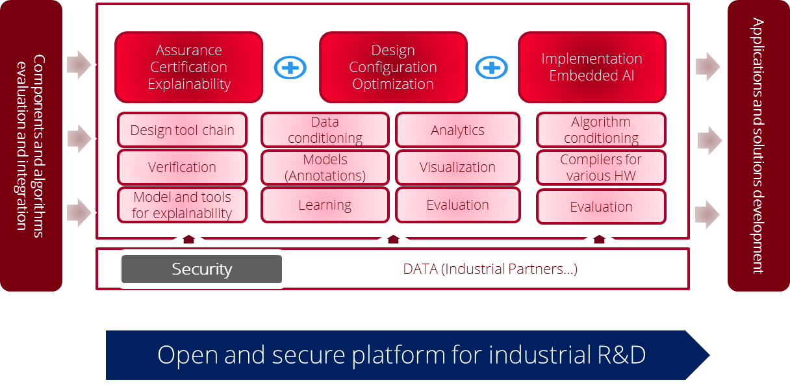
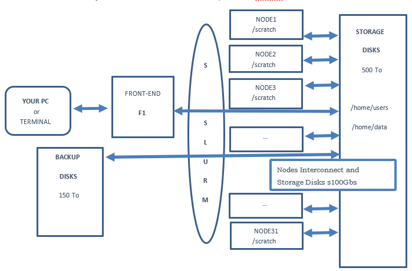
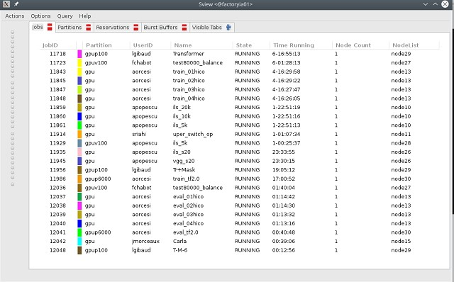

*Infrastructure provided by CEA*

*Overview of the infrastructure and deployment*

Factory IA is a secure platform for industrial R&D for conducting large
scale AI experiments on a world-class Supercomputer infrastructure at
the petaflops scale. It is hosted by CEA on its TERATEC campus and
supported by CEA LIST. Its goal is to provide a facility for the
evaluation of AI components and algorithms and to test their integration
in real-world systems. It allows CEA and its industrial and
institutional R&D partners to explore solutions to concrete problems in
AI such as safety, assurance certification, explainability; design,
configuration, and optimization of AI components; their deployment in
embedded systems (embedded AI), aiming towards the development of
applications and solutions ready to market.

|Diagrama Descripción generada automáticamente con confianza baja|

**Figure** **11: CEA - Big Data infrastructure framework.**

Factory-IA has 31 nodes (physical machines) available, with 876 CPU
physical cores in total, 165 GPU boards PCI EXP v3, 12 V100 SXM in
total, 400 000 CUDA cores, 7452Gb RAM memory. Regarding storage, it has
47 terabytes in SSD storage, 31 terabytes of NVME storage and 500
terabytes of SAS HDD storage.

Concerning the big data stack, it is composed of Hadoop, Spark, Docker
and additional open-source modules can be installed at request.
Factory-IA has been especially conceived for intensive machine learning
computation. Therefore, it also offers TensorFlow and PyTorch
distributions (Caffe2).

It is managed by a team of 30 collaborators and supports currently 60
internal users. The infrastructure features 1,2 Peta Flops, 8 V100 GPU
(400 000 cores), 9 Intel Skylake AVX512, 3GHz, (CPU bi-pro), Until 1Pb
disk storage (GPFS) + 200 Tb backup and bandwidth interconnection at
100Giga bits/s.

*Operation and issues*

Access request management

The generic access request management defined by REACH in D1.1 is
implemented by CEA. Table 2 summarises the basic workflow designed
during the elicitation of requirements. More specifically, it shows the
different steps of this workflow and indicates in which part of the
REACH infrastructure takes place.

**Table** **2: User Request Workflow.**

+----------------+-------------------------+-------------------------+
|                |    **User Request       |                         |
|                |    -Workflow**          |                         |
+================+=========================+=========================+
|    **Nº Step** | **Step Description      |                         |
|                | Where**                 |                         |
+----------------+-------------------------+-------------------------+
|    **1**       |    Request (done by the | Request Management      |
|                |    user - subgrantees)  | System Tool (RMST)      |
|                |    Sub-grantee must be  | (REACH Web Site)        |
|                |    a logged user        |                         |
+----------------+-------------------------+-------------------------+
|    **2**       |    Request is forwarded | RMST (to be forwarded   |
|                |                         | to a specific DIH       |
|                |                         | manually - negotiation  |
|                |                         | phase)                  |
+----------------+-------------------------+-------------------------+
|    **3**       |    Request Processing:  | DIHs                    |
|                |                         |                         |
|                | -  Availability of      |    • Authentication and |
|                |    Resources            |    authorisation (If    |
|                |                         |    needed)              |
|                | -  Resources            |                         |
|                |    allocation.          |                         |
|                |                         |                         |
|                | -  Inform to the user.  |                         |
|                |    Notice to the        |                         |
|                |    incubated company    |                         |
|                |    (email) on the       |                         |
|                |    procedure for the    |                         |
|                |    experimentation.     |                         |
+----------------+-------------------------+-------------------------+
|    **4**       |    Use of the Big Data  | User (subgrantees)      |
|                |    infrastructure for   |                         |
|                |    experimentation.     |                         |
+----------------+-------------------------+-------------------------+

Granting of access to Factory-IA

To get its specific login to Factory-IA infrastructure, the subgrantees
must send an email to **factoryia-request@cea.fr**. The requestor may
also send a RSA public key in order to connect without password.

A summary on how to get access to the platform and other operational
issues can be found at:
https://docs.reach-incubator.eu/reach-big-data-infrastructure/cea/index.html

*Training materials*

A. **First connection**

In order to connect to Factory-IA front-end machine:

**``$> ssh your-login@132.167.191.33``**

Login name is always in lower case.

i.e.: **``$>``** **firtCharOfYourFirstNameYourName**\ @factoryia01

for a user name : **alan turning** login is : **aturing**

If you want to display graphic window program (GUI) use **ssh –X**. Be
aware that too much **–X** connections (more than ten) can drastically
reduce display performance so please use –X option only if you really
need it.

In order to avoid IP address you can add “132.167.191.33 factoryia” line
into /etc/hosts. Having done this change, you should be able to use
status.factory-ai.cea.fr name instated of IP number.

It’s highly recommended to use RSA key in order to log on FactoryIA. So
you need to send your id_ras.pub file as an attachment to an email.

However, if you need to change your password type:

**``$> passwd``**

The password must be longer than 9 chars and contain at least one upper
case one lower case char and one numerical value.

**Important note**\ *: Only the front-end computer is connected to World
Wide Web, nodes are not. Also, the front-end do not have any GPU.*

B. **Hardware configuration**

The machine have **32 nodes**. All nodes are **bi processors** INTEL
Skylake with AVX512 support, with at least 48 threads and **192Go memory
RAM** for GPU and 72 threads for CPU, with local HardDisk 2To.

|Diagrama Descripción generada automáticamente|

**Figure** **12: Logical view of FactoryIA cluster.**

All nodes including front-end are connected together to the storage
disk. Anywhere you are your $HOME as /home/users directory is visible
(and also your $WORKDIR as /home/data/).

C. **Copy your data**

To copy your data to FactoryIA **you must always copy files from your
pc** to FactoryIA. (Because FactoryiA is exposed to internet)

``$> scp fromYourPCLocation yourf1login@factoryia:Path``

To get your IP address:

``$> ifconfig or $> ip add``

If you have a 22 port error may be you must install open ssh server on
your machine

``$> sudo apt-get install openssgh-server on ubuntu``

For large data used /home/data/ yourDir (as $WORKDIR with

WORKDIR=/home/data/yourDir) is limited up to 2To

If you have some problem on WORKDIR sub directory you could add in order
to set group rights:

``$> chmod -R g+s fileOrDir``

To share your sub directory to other group member

``$> chgrp -R yourgroup fileOrDir``

Your home directory /home/users/ your home as $HOME is limited up to
200Go

If you have special needs contact factoryia-request@cea.fr by email or
if you think, you can improve this documentation.

D. **Virtual environment**

First load module:

``$> module load anaconda/3-5.3.1``

Because of the need both in bash and SLURM script you could add this
line into your

$HOME/.bashrc file: module load anaconda

to see your virtual existing virtual env name :

``$> conda env list``

or

``$> conda-env list``

Create your virtual environment the last word python assume which
version number of python you want:

``$> conda create –y –n myenv python=3.6``

or

``$> conda create --name tfhoropy3 python=3.7 scipy=0.15.0``

see also .condarx for default env packages or use –no-default-packages
flag.

In order to get best performance of your code you should use **INTEL**
**library**:

Optimize for Intel CPU **conda -c**

``$> conda remove mpi4py``

``$> pip install mpi4py``

To see accurate packages list versions information

``$> conda info --envs``

``$> conda list``

``$> conda list –explicit``

``$> conda env remove --name myenv``

If you can prefer conda build xyz instead of conda install xyz

-  **To activate:**

``$> source activate myenv``

Depending of conda version

``$> conda activate myenv``

-  **To leave virtual env:**

**``$> conda deactivate``**

or

``$> source deactivate``

-  **To clone your env:**

**``$> conda create –name myclone –clone myenv``**

-  **To save/export your env (a):**

if your are in your virtual environment
**``$> conda env export --no-builds > MyEnvironment.yaml``**

Then copy or send via email yaml file to your partner

``$> pip freeze > requested.txt in your env``

Then

``$> pip install –r requested.txt``

-  **Reloaded import env to get same (b):**

**``$> conda-env create –n my_new_env –f=/path/to/ymlfile.yml``**

E. **SLURM**

The SLURM manager is the way to submit your jobs.

To see machine jobs activity under SLURM control of the Factory IA
front-end 1 (f1 for short):

``$> sview``

|Tabla Descripción generada automáticamente|

**Figure** **13: X window of SLURM queues and jobs activity.**

``$> squeue``

``$> squeue –l``

**Table** **3: Queues, user’s names and jobs ID of SLURM.**

========= ============= ======== ======== ========= ========== =========
**JOBID** **PARTITION** **NAME** **USER** **SATUS** **TIME**   **NODES**
========= ============= ======== ======== ========= ========== =========
11718     gpup100       test8000 lgibaud  RUNNING   6-16:55:47 1 node29
11723     gpuv100                fchabot  RUNNING   6-01:28:47 1 node27
11843     gpu                    aorcesi  RUNNING   4-16:30:32 1 node13
11848     Gpu                    aorcesi  RUNNING   4-16:26:39 1 node13
11859     Gpu                    apopescu RUNNING   1-22:51:53 1 node10
11860     Gpu                    apopescu RUNNING   1-22:51:50 1 node10
11861     Gpu                    apopescu RUNNING              1 node10
11914     Gpu                    sriahi   RUNNING              1 node11
11929     gpuv100                apopescu RUNNING              1 node28
11935     gpu                    apopescu RUNNING              1 node26
12036     gpuv100                fchabot  RUNNING              1 node27
12037     Gpu                    aorcesi  RUNNING              1 node13
12038     Gpu                    aorcesi  RUNNING              1 node13
12041     gpup6000               aorcesi  RUNNING              1 node30
12042     Gpu                    jmorceau RUNNING              1 node15
12048     gpup100                lgibaud  RUNNING              1 node29
========= ============= ======== ======== ========= ========== =========

To see only your jobs:

``$> squeue –u yourlogin``

report jobs status in queues :

``$> squeue -t RUNNING``

Other keywords are:

ENDING,

RUNNING,

SUSPENDED,

COMPLETED,

CANCELLED,

FAILED,

TIMEOUT,

NODE_FAIL,

PREEMPTED

STATUS meaning

PD : mean pending : the job is waiting for available resource before
running

R : running job in progress

CA : cancel from super user or user

Queues names:

**``$> sinfo``**

to see only one (your) partition

``$> sinfo -p gpuv100``

**Table** **4: Queues names and max time execution.**

============= ========= ============= ========= ============ ==========
**PARTITION** **AVAIL** **TIMELIMIT** **NODES** **NODELIST** **#GPUs**
============= ========= ============= ========= ============ ==========
cpu           Up        7 days        8         node[01-08]  0 per node
allcpu        Up        7 days        9         node[01-09]  0 per node
bigmem        Up        7 days        1         node09       0 per node
gpu-test      Up        2 hours       1         Node21       2 from 8
gpu           Up        7 days        17        node[10-26]  8 per node
gpuv100       Up        7 days        2         node[27-28]  4 per node
gpup6000      Up        7 days        1         node30       5 per node
gpup100       Up        7 days        1         node29       4 per node
amd           Up        7 days        1         node31       4 per node
Lva           Up        7days         1         Node32       4 per node
============= ========= ============= ========= ============ ==========

These commands are SLURM commands.

``$> srun -N 1 -n 1 -p partionname -w nodeid hostname i.e.:``

**``$> srun -N 1 -n 1 -p gpup6000,gpu nvidia-smi``**

-N 1 means only one machine

-n 1 means only one process

-p followed by the partition name you can specify more than one
partition separate by coma “,”

-w nodeID mean if possible use this node but with no guaranty

To run your job on only one GPU (or less than max in none exclusive
mode) and get the GPU slot number from Environment vars:

**``$> srun -N 1 -n 1 –p gpu --gres=gpu:1 env | grep CUDA_VISIBLE_DEVICES``**

Return: *CUDA_VISIBLE_DEVICE=0* for instance and

**``$> srun -N 1 -n 1 -p gpu --gres=gpu:2 env | grep CUDA_VISIBLE_DEVICES``**

Return: *CUDA_VISIBLE_DEVICE=0,1* for instance

**So DO NOT SET: CUDA_VISIBLE_DEVICES but let SLURM set it for you in
your.slurm file!**

If you want to deactivate GPU (so using Intel CPU only) you can’t set
CUDA_VISIBLE_DEVICES=-1

Report GPU configuration node:

**``$> srun -N 1 -n 1 -p partionname -w nodeid nvidia-smi``**

*srun* and *sbatch* (with file.slurm) use both the same syntax. An
example of slurm file is under:

**``$> cat /home/data/Samples/first.slurm``**

you can copy this file to your home

Another example for more advanced and fine control is **template.slurm**
in **/home/data/Samples**

Fairshare is not activate default MaxJob is set to 6.

SLURM main commands:

+-------------+-------------------------------------------------------+
| **COMMAND** | **DESCRIPTION**                                       |
+=============+=======================================================+
| sacct       | report job accounting information about active or     |
|             | completed jobs                                        |
+-------------+-------------------------------------------------------+
| salloc      | allocate resources for a job in real time (typically  |
|             | used to allocate resources and spawn a shell, in      |
|             | which the srun command is used to launch parallel     |
|             | tasks)                                                |
+-------------+-------------------------------------------------------+
| **sbatch**  | submit a job script for later execution (the script   |
|             | typically contains one or more srun commands to       |
|             | launch parallel tasks)                                |
+-------------+-------------------------------------------------------+
| **scancel** | cancel a pending or running job                       |
+-------------+-------------------------------------------------------+
| **sinfo**   | reports the state of partitions and nodes managed by  |
|             | Slurm (it has a variety of filtering, sorting, and    |
|             | formatting options)                                   |
+-------------+-------------------------------------------------------+
| **squeue**  | reports the state of jobs (it has a variety of        |
|             | filtering, sorting, and formatting options), by       |
|             | default, reports the running jobs in priority order   |
|             | followed by the pending jobs in priority order        |
+-------------+-------------------------------------------------------+
| **srun**    | used to submit a job for execution in real time       |
+-------------+-------------------------------------------------------+

F. **SLURM submission**

An example of slurm file is under:

**``$> cat /home/data/Samples/first.slurm``**

Request running:

**``$> sbatch mygreatjob.slurm``**

You can submit more than one job.

Inside your script you can make redirections with '&>'

SLURM create a file named slurm-<ID>.out get help on more options flags
: man sbatch Examples of batch file: /data/Samples/first.slurm

Interactif job :

``$> srun –N 1 –n 1 –c 24 –p cpu –pty bash``

To specify how many GPU you want to use on a node use *gres*.

Below 4 GPU board will be used.

#SBATCH –N 1 -n 1 -p gpuv100 --gres=gpu:4

Specific configuration of mixed node27

#SBATCH –N 1 -n 1 -p gpuv100 --gres=gpu:V100-SXM2-32GB:4

**In order to receive emails notification about your job status
(started, ended etc…) add:**

**#SBATCH** --mail-user=patrick.hede@cea.fr

**#SBATCH --mail-type=ALL**

Many other keywords are available.

---8<----------------------------- sample script : test.slurm

#!/bin/bash

#SBATCH -N 1

#SBATCH -n 1

#SBATCH -p gpu

#SBATCH -J test

#SBATCH --output=test_v1p1.out

#SBATCH --error= test_v1p1.err

#SBATCH --time=10:00:00 # HH:MM:SS

#SBATCH --mem=50000 # in MegaBytes

module load anaconda/3-5.3.1

module load cuda/10.0

export LD_LIBRARY_PATH=$HOME/cudnn/lib64:$LD_LIBRARY_PATH **export
CUDA_VISIBLE_DEVICES="0,1,2,3,4,5,6,7"** echo "CUDA devices:
$CUDA_VISIBLE_DEVICES"

echo "Starting..."

sleep 2000

#/bin/bash ./iterative_train.sh "v100_"

Hostname

echo "Done!"

Sample script using array:

Sample below show how to run multiple instances of your code with each
time different values (i.e. in order to find best parameter value)

#!/bin/bash

#SBATCH -N 1 # Nombre de noeud

#SBATCH -n 1 # nombre de processus

# #SBATCH -c 1 # nombre de threads = OMP_NUM_THREADS #SBATCH -J Typical
# nom du job

#SBATCH -w node02

#SBATCH --output=array.log

#SBATCH --time=1-10:00:00 # duree maximale d'execution 1 jour 10 minutes

#SBATCH -p cpu

# define different parameters to run with

**###SBATCH --array=4,8,15,16,23,42**

# mean loop from 32 to 512 with Step 8 and use only 1 job at the same
time

**#SBATCH --array=32-512:8%1**

# cooking

# module load gcc/7.4 cuda/10.0

# programme a executer echo $HOSTNAME echo "job task count :" echo
$SLURM_ARRAY_TASK_COUNT echo "job id :" echo $SLURM_ARRAY_JOB_ID echo "
running value :" echo $SLURM_ARRAY_TASK_ID

echo $SLURM_JOB_ID

This is a good way avoiding waiting available nodes to test values.

**Nota bene**

> You cannot directly connect on nodes to run you program. Nodes are
managed by SLURM manager. You have to indicate what queue you think is
the best for you. You can use \`-w\` flag to tell what node you prefer
but they are no guaranty that you get this one. Still you job is running
you can access to the node with \`ssh\` command.

Suppress/Kill a job:

**``$> scancel <ID>``**

Deliver information about jobs:

**``$> sacct -a``**

**Do not use GPU partition if your code do not use GPU if so use CP
partition.**

**Tensorboard** to see with tensorboard web server graphical data (does
not work with byobu): if who I am do not return your login your cession
is no longer valid please reconnect.

Becarfull tensorboard consume many memory, cpu and X resources that can
reduce
`dramatically <https://context.reverso.net/traduction/anglais-francais/dramatically>`__
access to other users, so please close your browser when is not
necessary.

**you must create a cpu virtual env in order to run tensorboad on the
front-end**. To do this you can import /home/data/Samples/tensorboardCPU
yml file

**``$> PORT=$(( RANDOM + 1024 ))``**

**``$> tensorboard --logdir ./logs/exp/pascal --port $PORT``**

**``$> chromium-browser --disable-gpu localhost:$PORT``** if Chromium is
launched without url:

**``$> echo $PORT``**

**``$> chromium-browser --disable-gpu``**

Then you must enter the following url: “localhost:xxxx”, xxxx being
given by the “echo $PORT” command.

G. **DOCKER**

You must address your request to use a docker to the administrator. In
order to be in user docker group.

You must address your request to use a docker image to the
administrator. After your request is accepted you should be able to run
your image declares in singularity.

**You can verify that you are in the right docker user group with:**

**``$> groups``**

**#!/bin/bash**

**#SBATCH –N 1**

**#SBATCH –n 4**

**#SBATCH –J testDocker**

**/shared/bin/dockinsl factoryia01:8080/centos “env;pwd;id;hostname”**

Display docker images available: **``$> repos-lis``**

**!!**

Dependant node configuration: **``$> docker image ls``**

or **``$> docker images``**

Running example:

**``$> sbatch dockerex.slurm``**

---8<---------------------------------------------------------------------------

#!/bin/bash

#SBATCH -N 1

#SBATCH -n 1

#SBATCH -p gpu

#SBATCH -J TestDocker

##SBATCH --gres=gpu:2

#SBATCH --gres=gpu:1

#SBATCH --nodelist node10

#SBATCH --time=2-23:59:59

/shared/bin/dockinslgpu factoryia01:8080/carla-lva "nvidia-smi"

---8<---------------------------------------------------------------------------

H. **Debugging**

You can use gdb on front-end or node to get information and find the
reason of your program fault

**``$> gdb myexec``**

Typical running and diagnostic execution:

**``$> gdb python``**

**>> r myscript.py param1**

**>>bt**

It’s possible to debug Python code source with

**``$> /shared/bin/pycharm``**

See gnu Debugger documentation and **FAQ** for more

I. **Optimization**

-  **Inside python you can use CPU/GPU:**

**``$> pip install pyinstrument``**

Running instead of python yoursrcipt.py type

**``$> pyinstrument -o outpoutprofile.html -r html ypurscript.py param1``**

At the end of your script execution display

**``$> firefox profile.pyi.html``**

**Pyspy**

-  **For binary code (i.e. C++)** if you feel that your code is too slow
   you can use

``$> top in order to see CPU activity, memory and IO wait (wa)``

``$> htop``

For c/c++ or any binary program, used maqao code quality to check
problems

``$> module load maqao for cpu execution is required.``

See also gcc documentation for graph call of c/c++source code.

-  **Another useful tools to profile your python code could be**

*``$> pip install pycallgraph``*

*``$> python -m cProfile -o output.pstats 03.primes-v1.py``*

display calling graph for python code

*``$> pip install gprof2dot``*

then

*``$> gprof2dot -f pstats output.pstats | dot -Tpng -o output.png``*

**Running browser**

*``$> python -m cProfile -o gpu.cprof train_dev.py –config``*

*$MYDIR/configs/hibiscus_HO_gpu.json --train_dir*

*$MYDIR/../experiments/testprofile* *then*

*``$> snakeviz hibiscus/gpu.cprof``*

*``$> conda install tensorflow -c intel``*

*``$> pip install intel-tensorflow``*

NVIDIA Visual Profiler: *``$> nvvp``*

*vprof can help to see/check memory consumtion*

running: *vprof -o profile.json.vprof -c cm "script.py param1"* dsiplay:
*vprof --input-file profile.json*

**In order to limit number of threads on a node**

*``$> taskset -c 0,1,2 main.py``*

**Use only thread 0,1 and 2 for execution use also #SBATCH –c <int>**

J. **Multi-nodes**

The FactoryIA is a HPC cluster with 100Gb/s interconnection allowing
high speed communication (gather/scatter) between nodes.

MPI allow you to use multi nodes inside a same program. With or without
multithreading multi nodes executions allow parallel execution in order
to reduce computing time. It’s possible to use MPI under C/C++ and
python program.

*Lessons learnt and future improvements*

During the first REACH open-call, CEA has not gotten a chance to benefit
from the return of experience of any subgrantees as the CEA hasn’t
receive access request to Factory-IA infrastructure. Nevertheless, from
previous experiences we collected a set of repetitive questions in the
form of FAQ (Frequently asked Questions) that are listed below.

1) **Why my job is in PENDING state?**

It is normal to wait a little. Don not looking for an available node
just submit with sbatch what you need. If you can add #SBATCH
–time=DD-HH:MM:SS to your file in order to help slurm to manage queues.

You can have (a pessimist) estimation of your job running time with: $>
squeue -start job numberOfYourJob

2) **How can I do in order to use only one slurm file with many
   parameters instead of using many nearly same slurm files?**

The Slurm directive ARRAY was create to do that you want. An example is
available under /home/data/Sample/template.slurm

3) **How can I run my tensorboard?**

The front-end do not have GPU because the front-end is not dedicated to
compute. So if you want to run tensorboard, you can import yaml file
from /home/data/Samples/ tf_.yml in your virtual env

Then you can run tensorbard board and display it with your favorite web
browser.

4) **Why my output file of my slurm job ( i.e. slurm-1234.out ) do not
   show my program values during the run?**

The FactoryIA cluster try to run your code as fast as possible. So many

Input/Output Disk operations are cached to increase performances. Son
sometimes (when the Operating System want) your print instruction will
be appear. In order to force python to flush is to run python : python
–u

In C/C++ you could use fflush (stdout). It depends of your language
used.

5) **How can I show only my job from queue?**

``$> squeue –lu mylogin``

``$> squeue –p gpu``

6) **How can I choose the best in order to run my job?** Use :
   find-best-partition –f mySlurmFile –o check

7) **Why job seem’s to be slow?**

Login on node and see *top* or *htop* information

8) **How to debug my code?**

It’s depend of the language you use. Contact me.

**Export I_MPI_DEBUG=5**

9) **What is the template of the final report needed for FactoryIA?**

1 page or more is requested. Explain what is your scientific context,
explain how many gpu, cpu memory and disk space you have used.

One image with curve or graphics is appreciate. What have you appreciate
and what could be improved on FactoryIA

10) **When I request more than one node to SLURM how I can get the name
    of nodes?**

scontrol show hostname SLURM_NODELIST > machinefile or fsl2hf.cpp
transform $SLUM_NTASKS to hostile

11) **How can I know my tensorflow version?**

If you use conda you can have all package version with

``$> conda list | grep tensorflow or``

``$> pip list | grep tensorflow``

12) **How to learn and test at the same time**

In your slurm script you can

… python -u test_sleep.py & python -u test_sleep2.py &

wait with the wait command slurm still stop when two progs will stop.

13) **My job was stope with kill sulrm**

sacct --format
JobID,Submit,Start,Account,User%20,JobName,AllocTRES%55,NodeList -a -X
-n -S2020-0401 -E2020-04-26 \| grep YourSlurmJobID

then login on node running process and lookfor your process in dmesg

**IO disk:**

-  Avoid having more than 5000 files per directory because operation
   like **``$> ls``** take long time. A solution is to make more sub
   directories or use **tar** comand.

-  Avoid having many small files less than 16Mb, like jpeg or png images
   files. A solution is to group file in a tar file instead.

Verify that you have enough free disk space :

**``$> /shared/bin/myquota``**

If you have some troubles verify your group with: **``$> groups``**
command

And verify that: **``$> who i am``** return correctly your login name
(sometime byobu is in trouble)

-  If a gpu node do not display information with nvidia-smi send an
   email.

If the file slurm-xyz.out file do not contain fresh data you should run
your python script with **``$> python -u``** oin order to force python
to flush your messages either you can type in your python script
**print(..., flush=True)**

In C/C++ fprintf( stdout, “blabla…”); fflush( stdout );

If your web browser is too slow during tensorboard display may be too
much users use –X (X11 remote display) so you should wait that the
network became more available. When you have finish your work please
makes sure that your graphic applications are closed.

When you use local disk of node(s) like (/scratch) please erase your
directory data at the end of your slurm script in order to allow
following users to work properly.

**An alternative to squeue is : showq**

**``$> /shared/slurm/bin/showq --help``**

If showq to do run type
**``$> export LD_LIBRARY_PATH=/shared/slurm/lib:$``**

**LD_LIBRARY_PATH** or add it in your .bashrc

**In order to help you to submit your job use find best partition name:
$> /shared/slurm/bin/find-best-partition –o help**

**To see actual rate cluster usage:**

**``$> php /shared/bin/dispo``**

Return something like : Le cluster est occupé a : **4**

**Editors available are :**

vi, vim, neovim, emacs, gedit, /shared/bin/sublime3, /shared/bin/pycharm
**GPU on FactoryIA front-end. Please note that the front-end do not have
any GPU. So if you want to compile or test some software you should use
gpu-test partition in order to avoid error.**

