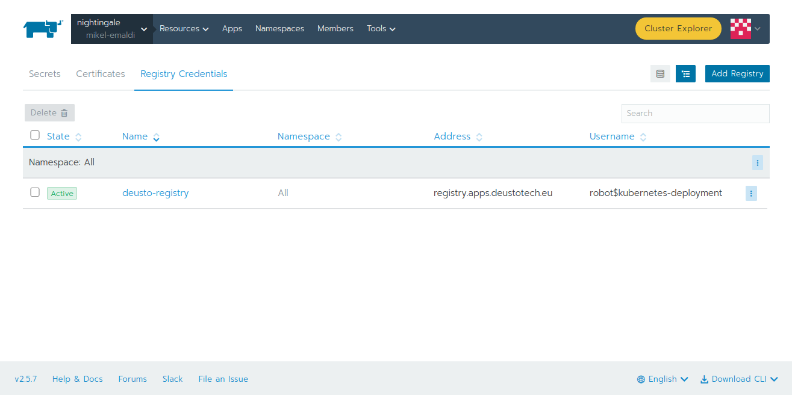

Deploy your own Kubernetes applications
---------------------------------------

.. note::
    If you don't have previous expertise with Kubernetes and you want to learn, you can start from `here <https://kubernetes.io/docs/tutorials/kubernetes-basics/>`_.

If you have worked with Kubernetes in the past or you have some expertise, you can try deploying your own apps and frameworks by yourself. For that,
you should request your credentials for deploying applications at the cluster at `https://support.reach-incubator.eu <https://support.reach-incubator.eu>`_.

.. note::
    Notice that the credentials for :ref:`jupyter-lab` and the credentials for deploying applications at the cluster are not the same.

Here you can find the basics for interacting with the Kubernetes cluster provided by Deusto:

.. contents::
    :depth: 3
    :local:

Rancher web interface
+++++++++++++++++++++

You can access to the Kubernetes web interface (Rancher) at `https://rancher.deustotech.eu/ <https://rancher.deustotech.eu/>`_. Here, you can use
your credentials for accessing to the cluster.

.. image:: img/rancher_login.png

Next, you must select the cluster you want to work with. In this case, there is a single cluster called "nightingale".

.. image:: img/rancher_select_cluster.png

From here, you can select your project.

.. image:: img/rancher_select_project.png

In this screen you can see your deployed workloads, load balancers, services, volumes and so on. Through the "Resources" menu you can access to
Secrets and ConfigMaps.

.. image:: img/rancher_empty_project.png

Before deploying anything within your project, you should create a namespace. For that, click on "Namespaces" tab and next, on "Add namespace" button.

.. image:: img/rancher_add_namespace.png

Although the usage of the web interface is helpufl for monitoring resources and as in the beggining the syntax could be confusing, we recommend 
using the YAML files for describing your Kubernetes resources and the Rancher CLI for deploying them. The usage of YAML configuration files
allow re-deploying your apps as many times as you want with a single CLI command, and, in addition, in the future you could deploy them in your 
own Kubernetes cluster.

For starting working with the cluster, you should download the Rancher CLI. For that, you can click on the "Download CLI" dropdown at the bottom-right
corner of the web interface, and select your OS.

.. image:: img/rancher_download_cli.png

Once the CLI is installed, the first step is to authenticate yourself in the cluster, with the following command:

.. code-block:: bash

    ./rancher login --token BEARER_TOKEN https://rancher.deustotech.eu

You can create your token clicking on your profile at the top-right area of the web interface, and next on "Api & Keys".

.. image:: img/rancher_api_keys.png

From here, you can add a new key clicking on "Add key". It is important to select "no scope" at the "Scope" dropdown.

.. image:: img/rancher_add_api_key.png

Once authenticated, you can deploy Kubernetes resources at the cluster using the ``rancher kubectl`` command.

Private Docker registry
+++++++++++++++++++++++

In order to allow uploading your private images to a Docker registry, Deusto offers you a private Docker registry, accessible 
at https://registry.apps.deustotech.eu. To use this registry, you must request your credentials at https://support.reach-incubator.eu.
You can check an example of how to use this registry at :ref:`creating-docker-image`.

.. note:: 

    Unfortunately, the credentials for the private registry, the cluster and the JupyterLab are not the same.

Deploying long-running applications
+++++++++++++++++++++++++++++++++++

To illustrate the usage of Rancher and Kubernetes, we will deploy a sample `Django <https://www.djangoproject.com/>`_ app, which can be found at 
`https://github.com/REACH-Incubator/django-polls <https://github.com/REACH-Incubator/django-polls>`_. This application is composed by a webserver and
a PostgreSQL database.

First, you should clone the git repository into your computer:

.. code-block:: bash

    git clone https://github.com/REACH-Incubator/django-polls

PostgreSQL deployment
.....................

Next, we are going to deploy the PostgreSQL database. As PostgreSQL is an app included into the app catalogue of the cluster, we can install it directly.
You can check all available apps with the following command:

.. code-block:: bash

    rancher app list-templates

For this example, we want to install the app template identified as ``c-tfxjq:bitnami-postgresql``. For customizing our deployment, we can use the 
``values.yaml`` file located at ``kubernetes/postgresql/values.yaml``. We can check the values supported by the app and its documentation at
`https://artifacthub.io/packages/helm/bitnami/postgresql <https://artifacthub.io/packages/helm/bitnami/postgresql>`_.

.. code-block:: yaml

    persistence:
      storageClass: longhorn
      size: 1Gi

In this case, we only have overrided a couple of values, i.e. the `storage class <https://kubernetes.io/docs/concepts/storage/storage-classes/>`_ 
used by the persistent volume and its size.

.. note::

    There is a single storage class available at this cluster: `longhorn <https://longhorn.io/>`_.

-- note::

    Notice that the storage unit is the `Gibibyte (Gi) <https://en.wikipedia.org/wiki/Byte#Multiple-byte_units>`_. The minimum size of a 
    Longhorn volume is 1Gi.

.. warning::

    Remember that containers are **volatile**, i.e. if a `Deployment <https://kubernetes.io/docs/concepts/workloads/controllers/deployment/>`_,
    a `Pod <https://kubernetes.io/docs/concepts/workloads/pods/>`_, or a `Job <https://kubernetes.io/docs/concepts/workloads/controllers/job/>`_
    exits, the data will be destroyed unless it is backed by a `Persistent Volume <https://kubernetes.io/docs/concepts/storage/persistent-volumes/>`_.

Once we have our ``values.yaml`` file ready, we can deploy our PostgreSQL instance:

.. code-block:: bash

    $ rancher app install --namespace test-namespace --values kubernetes/postgresql/values.yaml c-tfxjq:bitnami-postgresql postgresql
    run "app show-notes postgresql" to view app notes once app is ready

If we execute the ``rancher app show-notes postgresql``, we can display the installation notes:

.. code-block:: bash

    $ rancher app show-notes postgresql
    NOTES:
    ** Please be patient while the chart is being deployed **

    PostgreSQL can be accessed via port 5432 on the following DNS name from within your cluster:

        postgresql.test-namespace.svc.cluster.local - Read/Write connection

    To get the password for "postgres" run:

        export POSTGRES_PASSWORD=$(kubectl get secret --namespace test-namespace postgresql -o jsonpath="{.data.postgresql-password}" | base64 --decode)

    To connect to your database run the following command:

        kubectl run postgresql-client --rm --tty -i --restart='Never' --namespace test-namespace --image docker.io/bitnami/postgresql:11.11.0-debian-10-r84 --env="PGPASSWORD=$POSTGRES_PASSWORD" --command -- psql --host postgresql -U postgres -d postgres -p 5432

    To connect to your database from outside the cluster execute the following commands:

        kubectl port-forward --namespace test-namespace svc/postgresql 5432:5432 &
        PGPASSWORD="$POSTGRES_PASSWORD" psql --host 127.0.0.1 -U postgres -d postgres -p 5432

We can check the status of the deployment of our app at the web interface. Few minutes after the execution of the installation command, our app
will be ready:

.. image:: img/rancher_postgres_deployed.png

Django app deployment
.....................

Once we have the PostgreSQLdatabase deployed, we can deploy the Django app. First, let's check the database settings at ``mysite/settings.py``
(lines 84-93):

.. code-block:: python

    DATABASES = {
        'default': {
            'ENGINE': 'django.db.backends.postgresql',
            'NAME': os.environ.get('POSTGRES_DB'),
            'USER': os.environ.get('POSTGRES_USER'),
            'PASSWORD': os.environ.get('POSTGRES_PASSWORD'),
            'HOST': os.environ.get('POSTGRES_HOST'),
            'PORT': os.environ.get('POSTGRES_PORT'),
        }
    }

As we can see, our ``settings.py`` is retrieving the connection parameters from the environment variables set at the container. This allows 
dynamically obtaining those parameters in case we recreate the database and those parameters change, or if we want to move the application to
a different cluster.

In the same file, we can see that other settings like the ``SECRET_KEY``, the ``ALLOWED_HOSTS`` or the ``DEBUG`` mode flag have been refactorized to
environment variables.

.. _creating-docker-image:

Creating the Docker image and interacting with the private registry
===================================================================

The first step before deploying our Django app into the cluster, is to create the Docker image. The Docker image should contain our source code and
the necessary runtime. This image is specified at the ``Dockerfile`` file:

.. code-block:: docker

    FROM python:3

    RUN pip install Django==3.2.1 psycopg2==2.8.6

    ADD . /source

    WORKDIR /source
    ENTRYPOINT [ "/source/entrypoint.sh" ]

In this file, starting from the ``python:3`` image, we install the libraries required for running our application (i.e. Django and psycopg2) and
we copy our source code into the ``/source`` folder. Next, we indicate that the container must execute the following bash script on runtime 
(``/source/entrypoint.sh``):

.. code-block:: bash

    #!/bin/bash

    python manage.py runserver 0.0.0.0:8000

We can compile the image with the following command:

.. code-block:: bash

    docker build -t registry.apps.deustotech.eu/kubernetes-test/mysite:v0.0.1 .

.. warning::

    From here and onwards, don't forget to replace ``kubernetes-test`` with your project name at the private registry (continue reading |:smiley:| ).

Notice that we are tagging our image with the URL of a custom private repository instead the default Docker repository (i.e. `Docker Hub <https://hub.docker.com/>`_).
Of course, you can use Docker Hub or any repository you want, but at Deusto we offer the possibility of pushing your Docker images at a 
private repository.

Before uploading your images, you should create a project at the private registry. For that, access to the registry at 
`https://registry.apps.deustotech.eu <https://registry.apps.deustotech.eu>`_ with your credentials:

.. image:: img/rancher_registry_login.png

Next, you can create a new project clicking on "New Project" button:

.. image:: img/rancher_registry_new_project.png

For interacting with the private registry, first you should login with your credentials:

.. code-block:: bash

    $ docker login registry.apps.deustotech.eu
    Username: <your username>
    Password: <your password>
    Login Succeeded

Once you have created the project and you have authenticated yourself against the registry, you can push the previously built Docker image:

.. code-block:: bash

    $ docker push registry.apps.deustotech.eu/kubernetes-test/mysite:v0.0.1

Regarding to the Kubernetes deployment files, we will inspect the deployment file at `kubernetes/django/deployment.yaml`:

.. rli:: https://raw.githubusercontent.com/REACH-Incubator/django-polls/master/kubernetes/django/deployment.yaml
    :language: yaml
    :linenos:

In this documentation we cover only few aspects of the Deployment, but you can get more information at the
`Kubernetes documentation <https://kubernetes.io/docs/concepts/workloads/controllers/deployment/>`_.

At lines 13-14, the deployment strategy is defined. The Longhorn file system used in Deusto's cluster does not support node multi-attachment,
so, **if your Deployment is composed by containers attached to a Persistent Volume, the deployment strategy should be set to Recreate**.

At lines 20-21 the ``imagePullSecrets`` are defined. An imagePullSecret allows the cluster pulling a Docker image from a private registry.
To create a imagePullSecret, first, access to the private registry at `https://registry.apps.deustotech.eu <https://registry.apps.deustotech.eu>`_
and select your current project. Next, select the "Robot Accounts" tab and create a new robot account clicking on "New Robot Account".

.. image:: img/rancher_registry_new_project.png

Once you have created the new robot account, copy the generated token and go to your project at the Rancher web interface. Here, click on "Resources",
"Secrets" and click on "Registry Credentials" tab.

Here, click on "Add Registry" to create a new imagePullSecret. In the "Address" section you must select "Custom" and set ``registry.apps.deustotech.eu``.
In the "Username" field, you must set the name of your robot account (``robot$...``) and in the "Password" field you must paste the previously generated
token.

At lines 21-67 the different containers forming the deployment are described. In this case, a single container is described (the Django webapp).

For deploying the application, you must submit the following files to the cluster:

.. code-block:: bash

    $ rancher kubectl apply -f kubernetes/django/secret.yaml
    $ rancher kubectl apply -f kubernetes/django/configmap.yaml
    $ rancher kubectl apply -f kubernetes/django/deployment.yaml

Check the status of the app at the Rancher web interface. If something goes wrong, you can check the container's logs.

Once our application is up and running, we need to assign a URL to it. This is done through an 
`Ingress <https://kubernetes.io/docs/concepts/services-networking/ingress/>`_.
You can find an example ingress for our application at ``kubernetes/django/ingress.yaml``.

.. rli:: https://raw.githubusercontent.com/REACH-Incubator/django-polls/master/kubernetes/django/ingress.yaml
    :language: yaml
    :linenos:

At lines 9-15 we can define the different rules and hosts that expose our application. In this example, we define a single host
(``mysite.apps.deustotech.eu``) which points to the service exposed by ``mysite`` at port ``8000``.

.. note::

    Every host defined at Deusto's cluster must be under ``*.apps.deustotech.eu`` domain. You can define multiple level hosts such as
    ``myapp.myproject.apps.deustotech.eu``. Obviously, Ingress hosts are unique, so when developing this example, you must replace the host
    name by another one.

If you want to set the SSL certificate for your host, you can invoke the "cert-manager" app, installed at the Deusto's cluster. For that,
you must declare the ``tls`` section at lines 16-19. Here, we have to enumerate the hosts we want to generate the certificate for and
a secret name for each of them ("cert-manager" will create those secrets automatically). In addition, you must set the annotation 
``cert-manager.io/cluster-issuer``. Deusto's cluster offers two TLS issuers:

* ``letsencrypt-staging``: the Let's Encrypt staging issuer. Use this issuer for testing your application and ensuring that everything works.
* ``letsencrypt``: the Let's Encrypt production issuer. Use this issuer **only** when you are sure that your application works.

.. warning::

    We encourage the usage of ``letsencrypt-staging`` in development stages. The Let's Encrypt production issuer has strong limits described
    `here <https://letsencrypt.org/docs/rate-limits/>`_ , including a **five Duplicate Certificate limit** for a week. So, please, test your
    Ingress objects using the ``letsencrypt-staging`` certificate before switching to the production issuer.

You can deploy your Ingress in the same way that other Kubernetes files:

.. code-block:: bash

    $ kubectl apply -f kubernetes/django/ingress.yaml

Next, you can access to your app at https://mysite.apps.deustotech.eu.

Deploying jobs
++++++++++++++

In addition to long-running applications, Kubernetes allows deploying `Jobs <https://kubernetes.io/docs/concepts/workloads/controllers/job/>`_.
A Job, opposite to a Deployment which is expected to be running 24/7, has a beggining and an end. We can use Jobs for launching 
Machine Learning or Data Analytics, storing results in a persistent volume. 

In the following example, how to launch a Job for executing the Tensorflow MNIST Fashion dataset example is explained. You can find the example
at ``https://github.com/REACH-Incubator/kubernetes-job-example``. In this example, we propose a Job to make the predictions for our dataset, save 
those predictions on `MinIO <https://min.io/>`_, and visualize at JupyterLab.

MinIO deployment
................

MinIO is a Kubernetes-native object storage compatible with AWS S3. It can be described as a self-hosted AWS S3. In this example, we use MinIO to
store the results of our Job, and access them from JupyterLab.

The deployment of MinIO is similar to the PostgreSQL deployment explained at the previous example. Configuration parameters must be defined at 
the ``values.yaml`` file:

.. code-block:: yaml

    statefulset:
      replicaCount: 1
    persistence:
      storageClass: longhorn
      size: 10Gi
    defaultBuckets: "default"

You can get more information about the MinIO configuration parameters at https://artifacthub.io/packages/helm/bitnami/minio.

We can deploy MinIO with the following command:

.. code-block:: bash

    $ rancher app install --namespace job-example --values values.yaml c-tfxjq:bitnami-minio minio

Once MiniIO is deployed, we can launch our Job.

Launching the training Job
..........................

First, we have to build and push the Docker image into the repository. The Docker image is specified at the ``Dockerfile``:

.. code-block:: docker

    FROM tensorflow/tensorflow:2.4.1

    RUN pip install boto3
    RUN mkdir /source
    ADD mnist_example.py /source