Infrastructure provided by Deusto
=================================

Deusto provides the following computation environment:

    * 144 vCPU.
    * 375GB RAM.
    * Storage:

        * SSD: 7.04 TB
        * HDD: 19.8 TB
    * Powered by `Kubernetes <https://kubernetes.io/docs/concepts/overview/what-is-kubernetes/>`_.

Deusto offers three ways to take advantage of its cluster:

    1. Web access to JupyterLab.
    2. Usage of applications deployed by Deusto.
    3. Your own Kubernetes deployments.

Next, those different access methods are explained.

.. _jupyter-lab:

JupyterLab
----------

Deusto offers a JupyterHub instance in which each participant could have its own isolated `JupyterLab <https://jupyter.org/>`_ 
experimentation environment. JupyterLab is a web-based environment in which different Python libraries for Data Analytics
and Machine Learning are pre-installed. In Deusto's instance, the user can choose among the following distributions:

    * **jupyter/datascience-notebook**: Python 3 and everything in *jupyter/r-notebook* + dask, pandas, numexpr, 
      matplotlib, scipy, seaborn, 
      scikit-learn, scikit-image, sympy, cython, patsy, statsmodel, cloudpickle, dill, numba, bokeh, sqlalchemy, hdf5, 
      vincent, beautifulsoup, protobuf, xlrd, bottleneck, and pytables packages.
    * **jupyter/tensorflow-notebook**: Python libraries from *jupyter/datascience-notebook* + tensorflow and keras machine learning libraries.
    * **jupyter/all-spark-notebook**: Python, R, and Scala support for Apache Spark.

All distributions include git, allowing users checking out their own repositories and commiting their work. In addition, 
conda and pip package managers are available. More information about those distributions can be found at 
`https://jupyter-docker-stacks.readthedocs.io/en/latest/using/selecting.html <https://jupyter-docker-stacks.readthedocs.io/en/latest/using/selecting.html>`_.

Accessing to JupyterLab
+++++++++++++++++++++++

For accesing to JupyterLab, the user should request her credentials opening a ticket at `https://support.reach-incubator.eu <https://support.reach-incubator.eu>`_.

Next the user can access to JupyterLab at `https://jupyter.reach.apps.deustotech.eu <https://jupyter.reach.apps.deustotech.eu>`_. First, user 
must click on *"Sign in with keycloack"* in order to access to the platform.

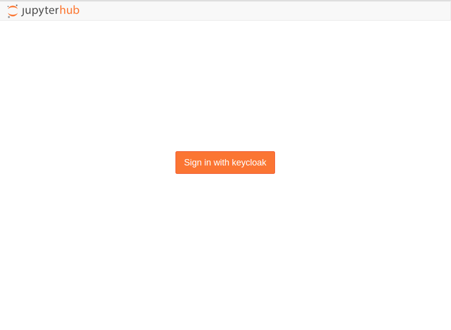

Next, the user is redirected to the authentication interface. Here, she must introduce her credentials.

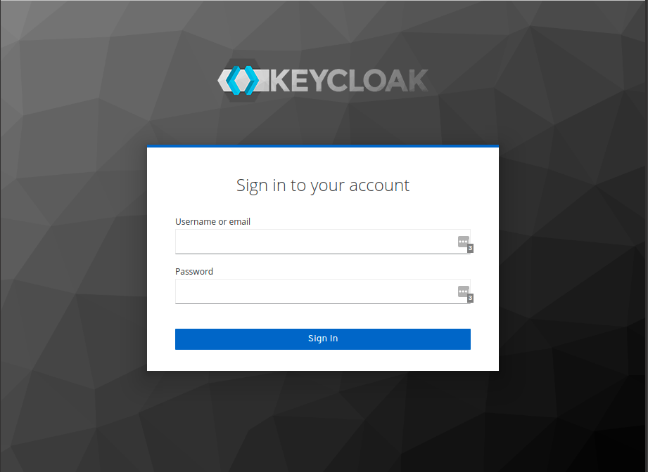

Once authenticated, user could select the desired distribution.

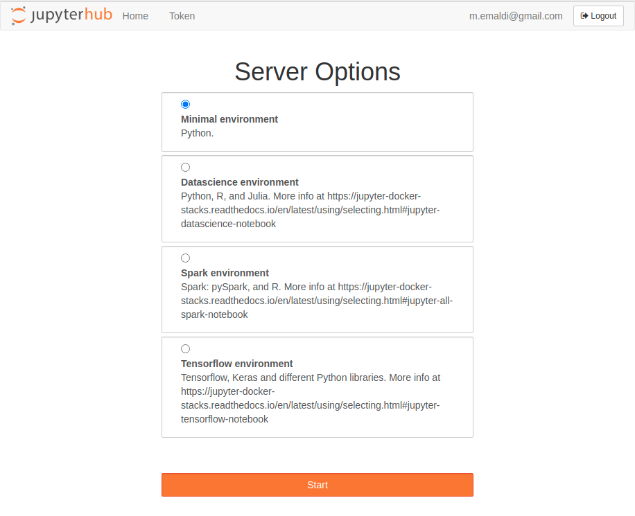

The following image depicts the main screen of the JupyterLab environment. From here, diferent notebooks can be created, even a web-based CLI for interacting
with the environment. At the right part, the file browser is displayed. Files created at the JupyterLab environment persist over different runs of the environment,
however, we recommend to use git to save changes on your developments.

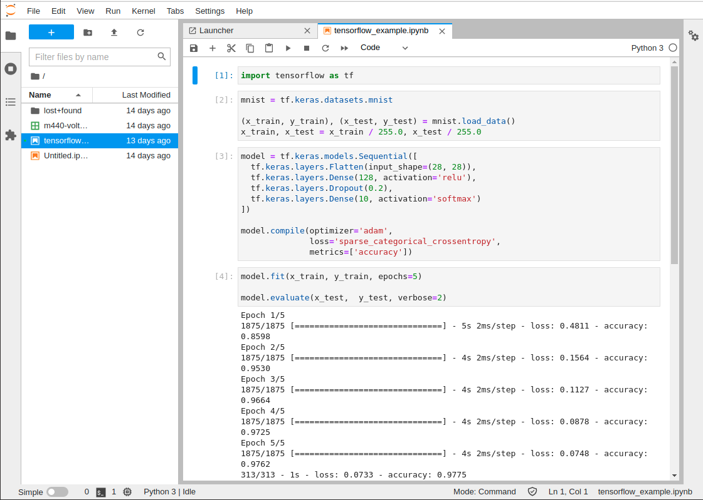

If you want to launch a different JupyterLab distribution you should recreate your instance. To do that, you must click on "File" and next on 
"Hub Control Panel".

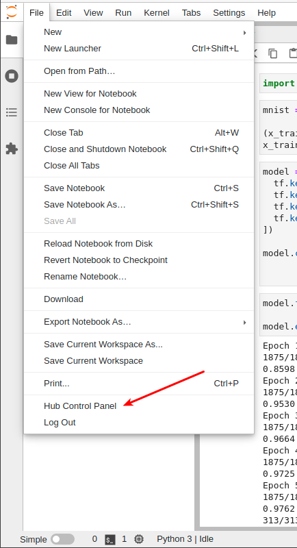

From here, you can manage your JupyterLab instance. Click on "Stop My Server" to stop your instance. When the instance is stopped (the stop button disappears),
click on "My Server" to recreate your instance with the selected ditribution.

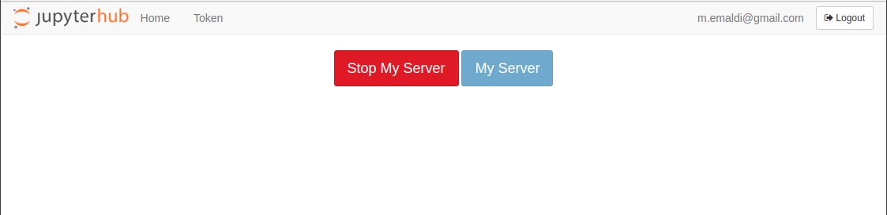

Applications deployed by Deusto
-------------------------------

The cluster offered by Deusto can host a wide variety of applications. There are two main sources in where you can check for applications and frameworks
which can be deployed at the cluster:

* `ArtifactHub.io <https://artifacthub.io/>`_.
* `Docker Hub <https://hub.docker.com/>`_.

Next, different applications related to Data Analytics and Machine Learning are listed:

* `Spark <https://artifacthub.io/packages/helm/bitnami/spark>`_
* `Kafka <https://artifacthub.io/packages/helm/bitnami/kafka>`_
* `Airflow <https://artifacthub.io/packages/helm/bitnami/airflow>`_
* `NiFi <https://artifacthub.io/packages/helm/cetic/nifi>`_
* `PyTorch <https://artifacthub.io/packages/helm/bitnami/pytorch>`_
* `Tensorflow <https://hub.docker.com/r/tensorflow/tensorflow>`_
* `Dagster <https://artifacthub.io/packages/helm/dagster/dagster>`_
* `Dask <https://artifacthub.io/packages/helm/dask/dask>`_
* `PostgreSQL <https://artifacthub.io/packages/helm/bitnami/postgresql>`_
* `MySQL <https://artifacthub.io/packages/helm/bitnami/mysql>`_
* `MongoDB <https://artifacthub.io/packages/helm/bitnami/mongodb>`_
* `Cassandra <https://artifacthub.io/packages/helm/bitnami/cassandra>`_
* `Neo4J <https://artifacthub.io/packages/helm/psu-swe/neo4j>`_
* `InfluxDB <https://artifacthub.io/packages/helm/bitnami/influxdb>`_
* `CouchDB <https://artifacthub.io/packages/helm/couchdb/couchdb>`_
* `Elasticsearch <https://artifacthub.io/packages/helm/bitnami/elasticsearch>`_
* `Solr <https://artifacthub.io/packages/helm/bitnami/solr>`_
* `Grafana <https://artifacthub.io/packages/helm/bitnami/grafana>`_
* `Kibana <https://artifacthub.io/packages/helm/bitnami/kibana>`_

If you want to use one of those applications or others hosted at `ArtifactHub.io <https://artifacthub.io/>`_ or `Docker Hub <https://hub.docker.com/>`_,
you must open a ticket at `https://support.reach-incubator.eu <https://support.reach-incubator.eu>`_. If you want to deploy an application or
framework not included at these sources, you could open a ticket requesting our support as well.

Your own Kubernetes deployments
-------------------------------

.. note::
    If you don't have previous expertise with Kubernetes and you want to learn, you can start from `here <https://kubernetes.io/docs/tutorials/kubernetes-basics/>`_.

If you have worked with Kubernetes in the past or you have some expertise, you can try deploying your own apps and frameworks by yourself. For that,
you should request your credentials for deploying applications at the cluster at `https://support.reach-incubator.eu <https://support.reach-incubator.eu>`_.

.. note::
    Notice that the credentials for :ref:`jupyter-lab` and the credentials for deploying applications at the cluster are not the same.

You can access to the Kubernetes web interface (Rancher) at `https://rancher.deustotech.eu/ <https://rancher.deustotech.eu/>`_. Here, you can use
your credentials for accessing to the cluster.

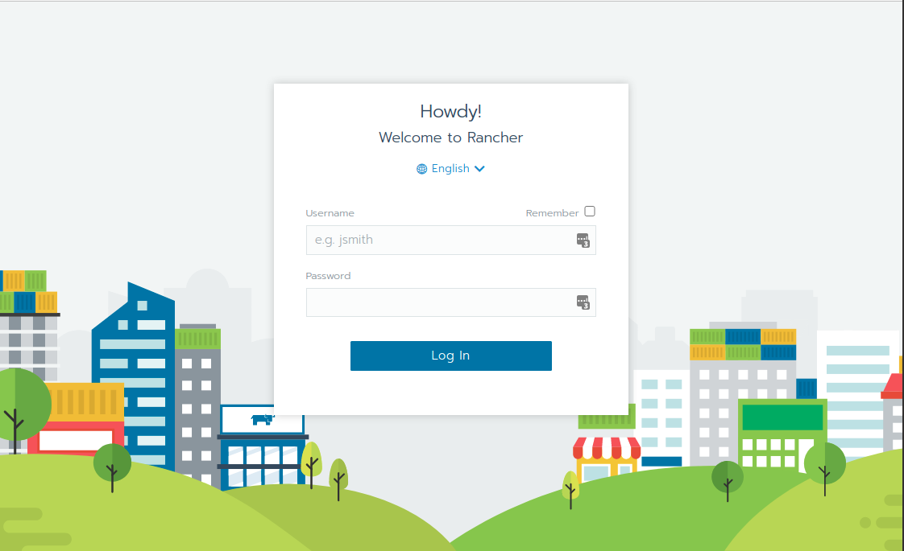

Next, you must select the cluster you want to work with. In this case, there is a single cluster called "nightingale".

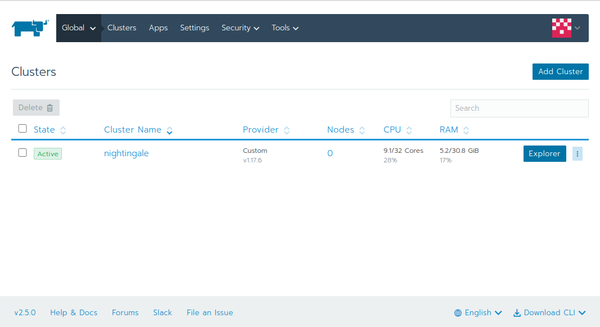

From here, you can select your project.

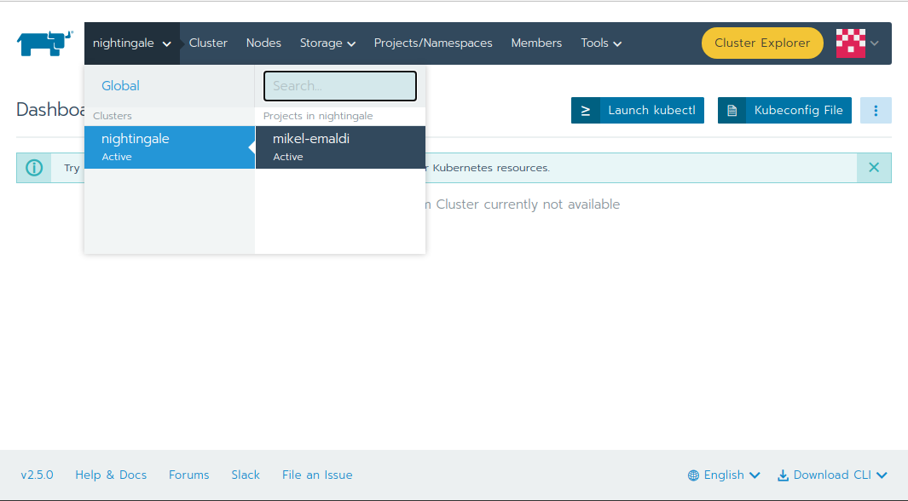

In this screen you can see your deployed workloads, load balancers, services, volumes and so on. Through the "Resources" menu you can access to
Secrets and ConfigMaps.

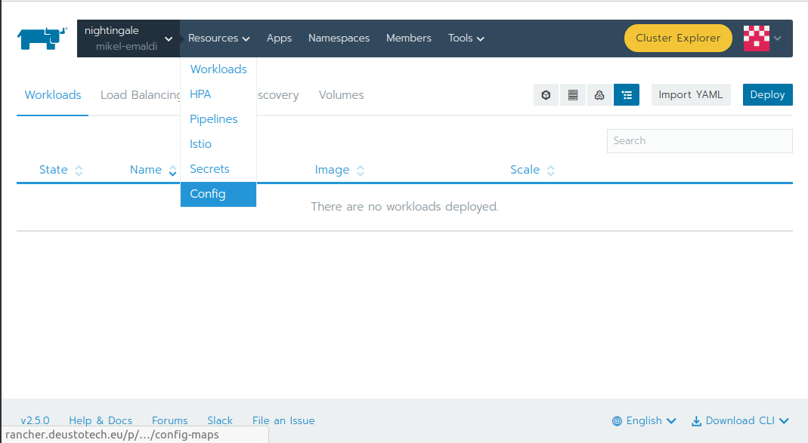

Before deploying anything within your project, you should create a namespace. For that, click on "Namespaces" tab and next, on "Add namespace" button.

Although the usage of the web interface is helpufl for monitoring resources and as in the beggining the syntax could be confusing, we recommend 
using the YAML files for describing your Kubernetes resources and the Rancher CLI for deploying them. The usage of YAML configuration files
allow re-deploying your apps as many times as you want with a single CLI command, and, in addition, in the future you could deploy them in your 
own Kubernetes cluster.

For starting working with the cluster, you should download the Rancher CLI. For that, you can click on the "Download CLI" dropdown at the bottom-right
corner of the web interface, and select your OS.

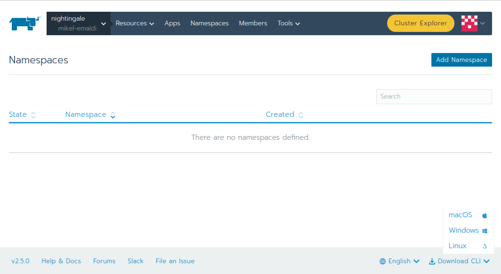

Once the CLI is installed, the first step is to authenticate yourself in the cluster, with the following command:

.. code-block:: bash

    ./rancher login --token BEARER_TOKEN https://rancher.deustotech.eu

You can create your token clicking on your profile at the top-right area of the web interface, and next on "Api & Keys".

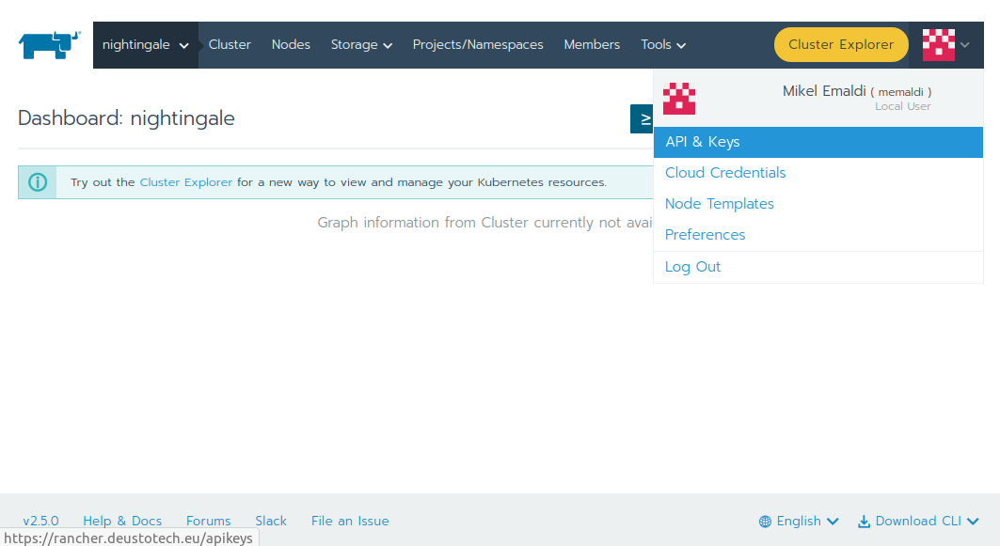

From here, you can add a new key clicking on "Add key". It is important to select "no scope" at the "Scope" dropdown.

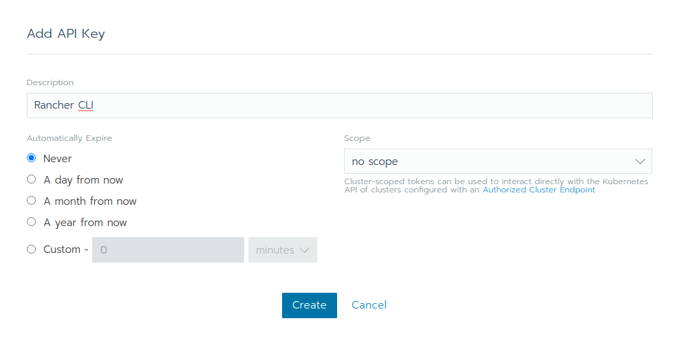

Once authenticated, you can deploy Kubernetes resources at the cluster using the ``rancher kubectl`` command.

Example Kubernetes deployment
+++++++++++++++++++++++++++++

To illustrate the usage of Rancher and Kubernetes, we will deploy a sample `Django <https://www.djangoproject.com/>`_ app, which can be found at 
`https://github.com/REACH-Incubator/django-polls <https://github.com/REACH-Incubator/django-polls>`_. This application is composed by a webserver and
a PostgreSQL database.

First, you should clone the git repository into your computer:

.. code-block:: bash

    git clone https://github.com/REACH-Incubator/django-polls

PostgreSQL deployment
.....................

Next, we are going to deploy the PostgreSQL database. As PostgreSQL is an app included into the app catalogue of the cluster, we can install it directly.
You can check all available apps with the following command:

.. code-block:: bash

    rancher app list-templates

For this example, we want to install the app template identified as ``c-tfxjq:bitnami-postgresql``. For customizing our deployment, we can use the 
``values.yaml`` file located at ``kubernetes/postgresql/values.yaml``. We can check the values supported by the app and its documentation at
`https://artifacthub.io/packages/helm/bitnami/postgresql <https://artifacthub.io/packages/helm/bitnami/postgresql>`_.

.. code-block:: yaml

    persistence:
      storageClass: longhorn
      size: 1Gi

In this case, we only have overrided a couple of values, i.e. the `storage class <https://kubernetes.io/docs/concepts/storage/storage-classes/>`_ 
used by the persistent volume and its size.

.. note::

    There is a single storage class available at this cluster: `longhorn <https://longhorn.io/>`_.

.. warning::

    Remember that containers are **volatile**, i.e. if a `Deployment <https://kubernetes.io/docs/concepts/workloads/controllers/deployment/>`_,
    a `Pod <https://kubernetes.io/docs/concepts/workloads/pods/>`_, or a `Job <https://kubernetes.io/docs/concepts/workloads/controllers/job/>`_
    exits, the data will be destroyed unless it is backed by a `Persistent Volume <https://kubernetes.io/docs/concepts/storage/persistent-volumes/>`_.

Once we have our ``values.yaml`` file ready, we can deploy our PostgreSQL instance:

.. code-block:: bash

    $ rancher app install --namespace test-namespace --values kubernetes/postgresql/values.yaml c-tfxjq:bitnami-postgresql postgresql
    run "app show-notes postgresql" to view app notes once app is ready

If we execute the ``rancher app show-notes postgresql``, we can display the installation notes:

.. code-block:: bash

    $ rancher app show-notes postgresql
    NOTES:
    ** Please be patient while the chart is being deployed **

    PostgreSQL can be accessed via port 5432 on the following DNS name from within your cluster:

        postgresql.test-namespace.svc.cluster.local - Read/Write connection

    To get the password for "postgres" run:

        export POSTGRES_PASSWORD=$(kubectl get secret --namespace test-namespace postgresql -o jsonpath="{.data.postgresql-password}" | base64 --decode)

    To connect to your database run the following command:

        kubectl run postgresql-client --rm --tty -i --restart='Never' --namespace test-namespace --image docker.io/bitnami/postgresql:11.11.0-debian-10-r84 --env="PGPASSWORD=$POSTGRES_PASSWORD" --command -- psql --host postgresql -U postgres -d postgres -p 5432

    To connect to your database from outside the cluster execute the following commands:

        kubectl port-forward --namespace test-namespace svc/postgresql 5432:5432 &
        PGPASSWORD="$POSTGRES_PASSWORD" psql --host 127.0.0.1 -U postgres -d postgres -p 5432

We can check the status of the deployment of our app at the web interface. Few minutes after the execution of the installation command, our app
will be ready:

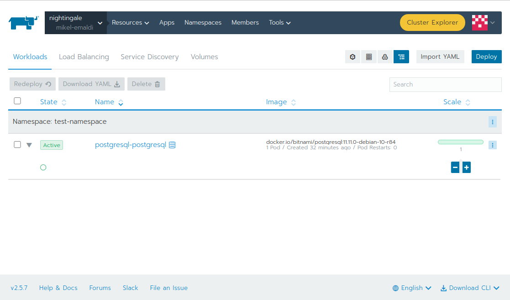

Django app deployment
.....................

Once we have the PostgreSQLdatabase deployed, we can deploy the Django app. First, let's check the database settings at ``mysite/settings.py``
(lines 84-93):

.. code-block:: python

    DATABASES = {
        'default': {
            'ENGINE': 'django.db.backends.postgresql',
            'NAME': os.environ.get('POSTGRES_DB'),
            'USER': os.environ.get('POSTGRES_USER'),
            'PASSWORD': os.environ.get('POSTGRES_PASSWORD'),
            'HOST': os.environ.get('POSTGRES_HOST'),
            'PORT': os.environ.get('POSTGRES_PORT'),
        }
    }

As we can see, our ``settings.py`` is retrieving the connection parameters from the environment variables set at the container. This allows 
dynamically obtaining those parameters in case we recreate the database and those parameters change, or if we want to move the application to
a different cluster.

The first step before deploying our Django app into the cluster, is to create the Docker image. The Docker image should contain our source code and
the necessary runtime. This image is specified at the ``Dockerfile`` file:

.. code-block:: docker

    FROM python:3

    RUN pip install Django==3.2.1 psycopg2==2.5.4

    ADD . /source

    WORKDIR /source
    ENTRYPOINT [ "/source/entrypoint.sh" ]

In this file, starting from the ``python:3`` image, we install the libraries required for running our application (i.e. Django and psycopg2) and
we copy our source code into the ``/source`` folder. Next, we indicate that the container must execute the following bash script on runtime 
(``/source/entrypoint.sh``):

.. code-block:: bash

    #!/bin/bash

    python manage.py runserver 0.0.0.0:8000

We can compile the image with the following command:

.. code-block:: bash

    docker build -t registry.apps.deustotech.eu/kubernetes-test/mysite:v0.0.1 .

.. warning::

    From here and onwards, don't forget to replace ``kubernetes-test`` with your project name at the private registry (continue reading |:smiley:| ).

Notice that we are tagging our image with the URL of a custom private repository instead the default Docker repository (i.e. `Docker Hub <https://hub.docker.com/>`_).
Of course, you can use Docker Hub or any repository you want, but at Deusto we offer the possibility of pushing your Docker images at a 
private repository.

To use our private repository accessible at `https://registry.apps.deustotech.eu <https://registry.apps.deustotech.eu>`_, you should request your
credentials at the REACH support system (`https://support.reach-incubator.eu <https://support.reach-incubator.eu>`_).

.. note:: 

    Unfortunately, the credentials for the private registry, the cluster and the JupyterLab are not the same.

Before uploading your images, you should create a project at the private registry. For that, access to the registry at 
`https://registry.apps.deustotech.eu <https://registry.apps.deustotech.eu>`_ with your credentials:

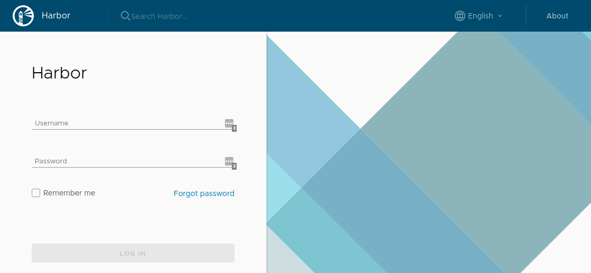

Next, you can create a new project clicking on "New Project" button:

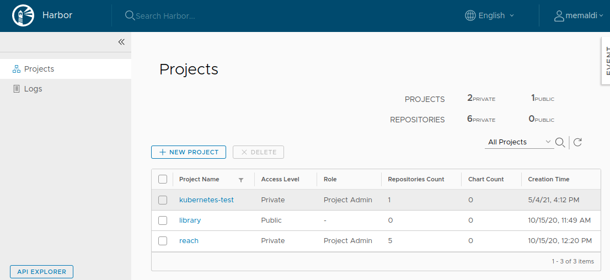

For interacting with the private registry, first you should login with your credentials:

.. code-block:: bash

    $ docker login registry.apps.deustotech.eu
    Username: <your username>
    Password: <your password>
    Login Succeeded

Once you have created the project and you have authenticated yourself against the registry, you can push the previously built Docker image:

.. code-block:: bash

    $ docker push registry.apps.deustotech.eu/kubernetes-test/mysite:v0.0.1

Regarding to the Kubernetes deployment files, we could start inspecting the deployment file at `kubernetes/django/deployent.yaml`

