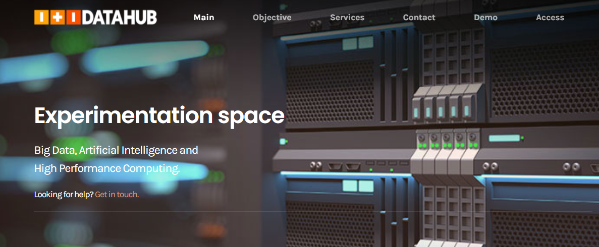
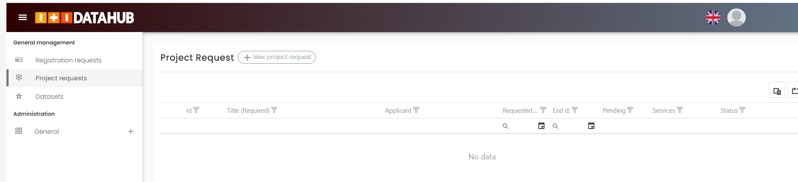

Getting access to the Infrastructure
====================================

.. note::	

    Please, go to https://support.reach-incubator.eu/ (Redmine) and create a ticket (request) for getting access the `Datahub <https://datahub.iti.upv.es/>`_ framework. if you don’t have an account in Redmine yet, please ask for your credentials. 
	
		
Login/Sign-up
-------------

After creating a ticket in  https://support.reach-incubator.eu/, you will receive follow-up instructions.

You will be redirected to the main page of the  `Datahub <https://datahub.iti.upv.es/>`_  : 

 
In order to make use of `Datahub <https://datahub.iti.upv.es/>`_ infrastructure, the user will need to create an account at ITI DataHub, by filling the sign-up form. 

.. note::
    Note than only users already registered in the REACH system will be granted access to this platform.
     ITI Support team may already have created an account for you (Redmine ticket). In this case, you will be redirected directly to the login page. `Login Datahub <https://intranet.datahub.iti.es/#/login>`_.

.. image:: img/datahub2.png

Once you enter to the DATAHUB platform you will be able to see the work environment where you will be able to: 

* Create Request of resources/services for doing your experiments or,
* Upload your datasets. 

.. toctree::
   :maxdepth: 1
 
   requestresources
   uploaddatasets
   deploysolution
	