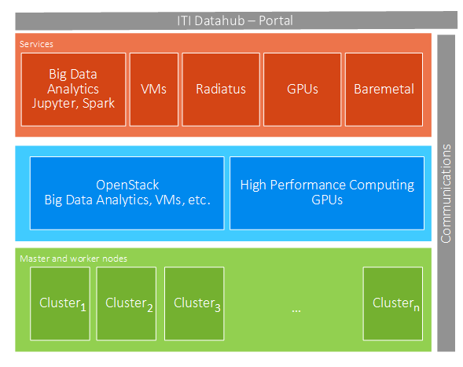

Infrastructure provided by ITI
==============================

ITI DataHub infrastructure is composed of a cluster computing with two differentiate environments. 

1. An infrastructure environment based on Openstack  for Big Data and AI solutions. 
2. An infrastructure environment with high-performance computing capabilities intended for solutions that require compute intensive workloads and intensive operations and, therefore, GPUs usage.

The following 

.. toctree::
   
   howtostart
   request												
   usrguide
	
	