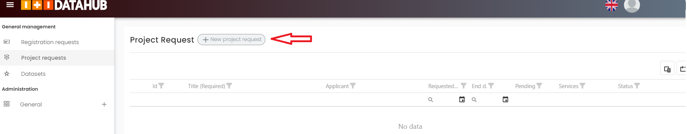
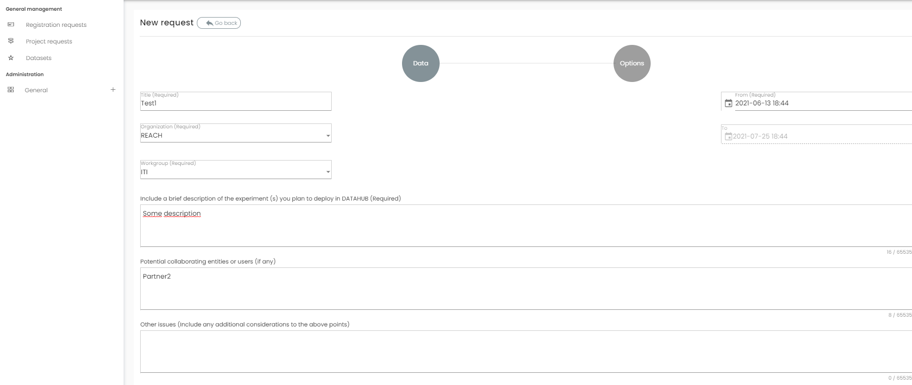
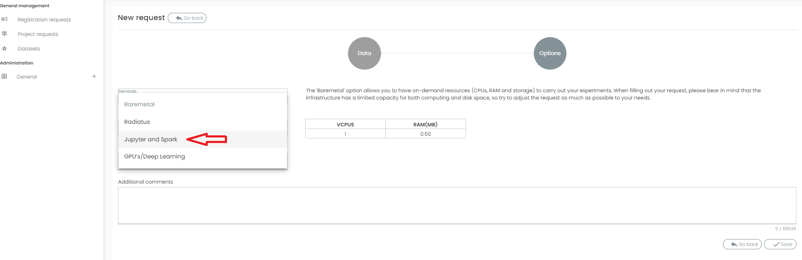
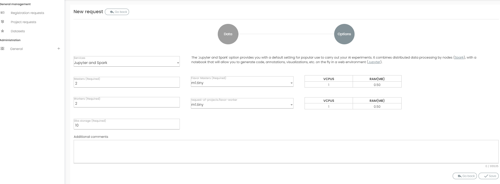
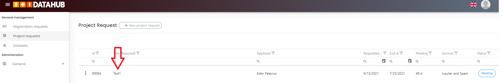
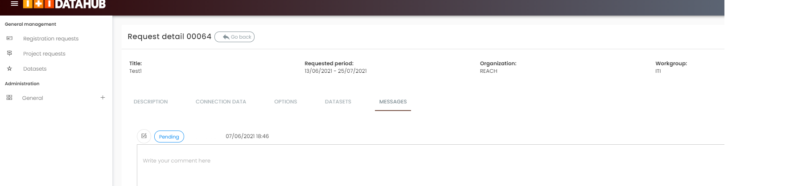

Create a request for Resources/Services
=======================================

.. note::
    You must be logged first to create a request. `Login Datahub <https://intranet.datahub.iti.es/#/login>`_.

Request Jupyter/Spark Service
=============================

Once you have entered `Datahub <https://datahub.iti.upv.es/>`_  Platform, the workspace will show up on the screen. 
On the righ-hand side of the screen you will see the folllwing options:

* Project Requests
* Datasets

Select the option "Project Request" and click on "New project request". 

Fill-in the form with the basic required information and click "Next". 

You will be guided step by step during the process. Please, fill-in the form according the requirements of your experiment (Jypiter/Spark, GPUs, etc). 

Then, by clicking on the “next” button a new form is presented to the user. This form requires more detailed technical information for the experiment, with the following options: 

* Type of service: Baremetal, Jypyter, and Spark, etc. 
* Number of Nodes
* Memory
* Number of mater nodes
* Number of worker nodes

Finally, click on "save" button. Your request has been now set to "pending" status. Until approved you can communicate with the Support Team by clicking your on your current request under the Messages Tab.  

Once approved, you will receive follow-up intrucctions for execute your experements. 

.. toctree::
   :maxdepth: 1

   uploaddatasets
   deploysolution