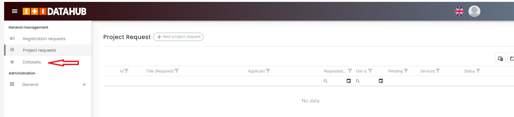
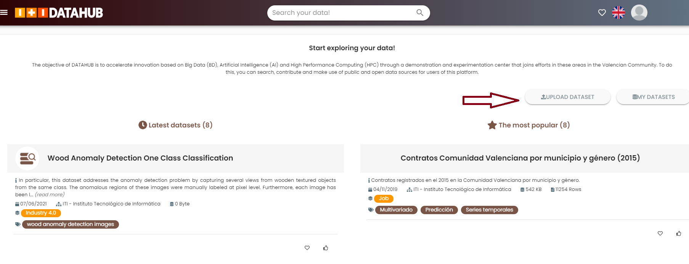

Upload datasets
===============

.. note::
    You must be logged first to create a request. `Login Datahub <https://intranet.datahub.iti.es/#/login>`_.

.. note::

    **Note on the Data Governance Principles at ITI DataHub**. 
	
    Please, be aware that before you can upload your datasets to the Datahub, a technical committee of ITI should approve the uploading of the dataset. This process will take approximately two days. After you receive an email of confirmation you will be able to upload your datasets. The support team will be available for you during the whole process. 

Upload a full dataset
---------------------
Go to https://support.reach-incubator.eu/ and create a ticket (request). Please, add the following information to your request/ticket: 

* DIH of selection: ITI. 
* Characteristics of the dataset to upload. They should include: 
* Name	
* 	Challenge title
*	License
*	Attributes of the data	
*	Please, indicate the format of the DATA SAMPLE (CSV, XML, JSON...)	
*	Organization is the owner of the data
*	Author name	
*	Author email	
*	Data owner
*	Dimension (in Giga or Tera) of your FULL DATASET. 

Once the ticket/request has been created, the Team Support in ITI should be contacting you to follow-up with the next steps. 
You will be redirected to the following web: `Login Datahub <https://intranet.datahub.iti.es/#/login>`_.

After receiving an email of confirmation, please login to the web `Login Datahub <https://intranet.datahub.iti.es/#/login>`_.

Your work environment will show up on the screen.  The workspace is very intuitive, you can see on the left-hand side of the screen the options for projects & datasets. The right-hand side of the screen changes depending on the selection of the options: Datasets or Project Requests. See the following figure. 

The workspace will show up on the screen. 
On the left-hand side of the screen you will see the folllwing options:

* Project Requests
* Datasets

Selecting the option "datasets" the following screen is shown in your browser. 

Now click on the button “Upload Dataset” and the following window will appear in your screen. You will have to fill-in the form with information very similar to the one you provided in your request.

.. image:: img/dataset2.png

Click on Save button. Your dataset is already loaded in the system ready to be used in the experiments. 

