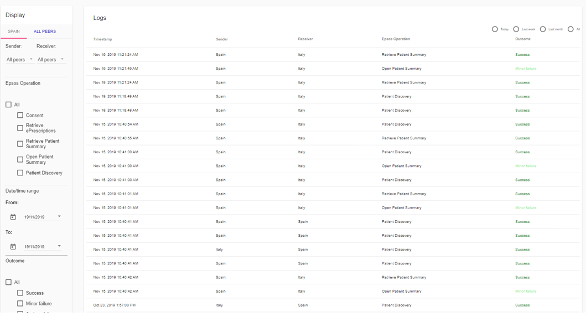

Overview of CERTH Audit Messages Storage Tool
=============================================

CERTH Audit Messages Storage is a tool that enables the storage of audit messages in the Blockchain. It also provides an Explorer (User Interface) which enables retrieval of the stored messages using several searching criteria as well the validation of the integrity of the messages. 

The purpose is to enable:
1. Auditability and non-repudiation of actions via the immutable storage of audit messages in the Blockchain
2. Traceability of the audit messages via the provided Explorer
3. Integrity check of the stored messages via the provided Explorer. 

The Explorer is built with Angular.js and Angular Material, there is a node.js middleware API and a hierarchy of smart contracts written in Solidity deployed on the Hyperledger Sawtooth Platform.

Getting access to the Infrastructure
====================================

.. note:: 
  To obtain access, contact us by mail to the consortium address.

Audit messages tracing
----------------------

An authorized user enters an Explorer providing a User interface and searches stored message logs based on a set of criteria. 

.. image:: img/Audit1.png

Audit messages storage
----------------------

Two interoperable information systems send a message to each other using SoA and web services. An intermediate system filters critical messages, encrypts the sensitive parts if applicable, and encodes them in an appropriate format (e.g. JSON). The intermediate system sends the critical messages to the Smart Contracts deployed in the Blockchain network. The Smart Contracts store the critical messages in the Blockchain, in an immutable way.

Messages integrity verification
-------------------------------

The Explorer queries the Smart Contracts deployed for the specific logs and returns them to the Explorer. If the User is authorized, they are able to see the details of the returned message and also verify the integrity of the message.

.. image:: img/Audit3.png

Use case
--------
The tool is adapted for systems in which there is an exchange of messages between distributed components using SoA, using a blockchain system with deployed Solidity smart contracts to store logs for the exchange of the messages including metadata, in a secure an immutable way, and there is also a need to search for this log and check its integrity.
