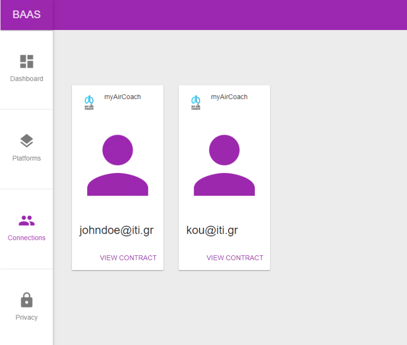
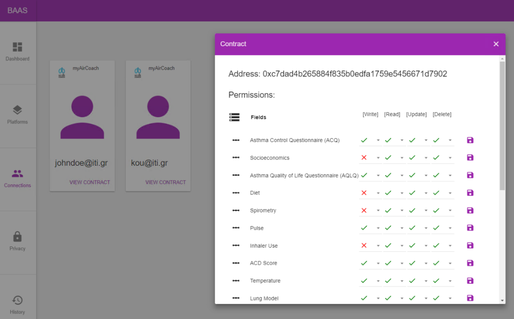

Overview of CERTH Blockchain as a Service (BaaS)
================================================

BaaS is a Blockchain solution which allows the secure integration of Web / Cloud Platforms with a private Ethereum Blockchain with an aim to enable efficient permission management as regards the data of the platforms’ users. Via the BaaS, the platforms following functionalities are logged in the Blockchain as immutable transactions:

1. User Registration
2. User Login/Logout
3. user requests permissions to access another user data
4. User gives permissions to access their data
5. User updates the permissions to access their data. 

Getting access to the Infrastructure
====================================

.. note:: 
  To obtain access, contact us by mail (<krinidis@iti.gr>, <ggogos@iti.gr>) to the consortium address.
  
Login/Sign up
-------------

.. image:: img/Blockchain1.png

Within REACH, there is a need to establish an agreement between the sides of the data exchange and provide accountability and traceability. BaaS provides the basis for accountability since logging the data value chain interactions functionalities in the Blockchain in an immutable way, allows for accountability, auditability, and nonrepudiation of critical actions.

Trace transactions
------------------

BaaS features the view of historical transactions which addresses the REACH toolkit need for traceability of data transactions. BaaS is portable to other Blockchain Platforms in accordance with the needs of REACH. In frames of REACH will support third parties data stewardships and time-restricted permissions; third party data stewardship will be based on the design specified in this work.

Use case
--------

BaaS is adapted for companies developing a web/cloud platform that manages user data, and using a Blockchain network with deployed Solidity smart contracts that handle the permissions that the users of the platform give to other users.
