############
Introduction
############

********
Preamble
********

===================
Intended readership
===================

This document covers the use for the following users of the *FedEHR
Anonymizer* software:

1.  Users
2.  Profile Managers

=============
Applicability
=============

This Software User Manual (SUM) applies to the *FedEHR Anonymizers*
software.

=================
Problem reporting
=================

In any case of problem, do not hesitate to email us: support@gnubila.fr

**************************
How to get a Trial Account
**************************

In order to get a trial account on our test server to evaluate the Fedehr Anonymizer,
just send a email to: support.anonymizer@gnubila.fr.

It's possible to request a user account or an application account.

* User accounts are for using the Anonymizer services with the web app GUI.
    * In order to create your user account, please provide us with a username, a valid email and the project context in which this account will be used.
* Application accounts are for connecting and using the Anonymizerservices through the REST api.
    * In order to create your application account, please provide us with an application username and the project context in which this account will be used.

Your account temporary password will be replied to your request email.
A new password will be asked on your first connection.

********
Overview
********

=================
FedEHR Anonymizer
=================

The FedEHR Anonymizer module of the `FedEHR <https://www.fedehr.com>`_  suite
used in several cross-enterprise and transactional data federations,
offers a wide range of data cleaning, privacy filtering and information
encryption routines to ano/pseudo-nymize medical sensitive information,
and conforming to national laws and international regulations.

It is generic by design and therefore configurable to respond to the
latest and evolving data privacy regulations. The proposed version of
FedEHR Anonymizer will be widely customizable through the privacy
profiles.

The FedEHR Anonymizer is able to process different file types like
Digital imaging and communications in medicine files (or
`DICOM <http://dicom.nema.org/>`_), CSV files (Comma-Separated Values), etc.

*Note: The privacy profile will be defined during the customization
period.*

==========================
Data privacy and standards
==========================

Thanks to its Anonymizer component, FedEHR can
handle different sorts of anonymization / pseudonymization techniques.
Following the International Organization for Standardization
(`ISO <http://www.iso.org/iso/home/store/catalogue_tc/catalogue_detail.htm?csnumber=63411>`_): 
Pseudonymization (from pseudonym) allows for the removal of an
association with a data subject. It differs from anonymization
(anonymous) in that it allows for data to be linked to the same person
across multiple data records or information systems without revealing
the identity of the person. The technique is recognized as an important
method for privacy protection of personal health information. It can be
performed with or without the possibility of re-identifying the subject
of the data (reversible or irreversible pseudonymization).

Supporting the Health Insurance Portability and Accountability Act
(`HIPAA <http://privacyruleandresearch.nih.gov/pr_08.asp>`_) , as described
in the Privacy Rule, as well as the EC Data Protection Directive
95/46/EC and E-Privacy Directive 2002/58/EC
(`Directive <http://eur-lex.europa.eu/LexUriServ/LexUriServ.do?uri=CELEX:32002L0058:en:HTML>`_)
, FedEHR Anonymizer can de-identify all concerned health information.
More particularly, the Anonymizer comes with a default configurable
filter removing all elements potentially identifying an individual or
individual's relatives, employers, or household members. FedEHR
Anonymizer offers different ano/pseudo-nymization strategies which can
be fine-tuned according to the project / initiative / partner / client
specific requirements.

The FedEHR Anonymizer extensible architecture has also been designed to
support the General Data Protection Regulation
(`GDPR <http://www.europarl.europa.eu/sides/getDoc.do?type=TA&reference=P7-TA-2014-0212&language=EN>`_)
, which the European Community (EC) has adopted.

********************
Master Patient Index
********************

The Master Patient Index (MPI) is an electronic database use for the reversible
pseudonymization process. The MI stores and maintains a correspondence
between the original data and the one which has been produced to replace
it. For the moment, only the following functions use this database: *
@integer(...), * @uuid(...), * @resolveId(...), * @resolveUuid(...)

########
Security
########

***************
OpenId security
***************

The Anonymizer is available as a Sofware as a Service application.
To secure its access an OpenId implemented solution by Keycloak is used.

Three types are accounts are available:

* Users accounts: they can view, edit, delete and run anonymization profiles they have access to.
* Profile Manager accounts: they can create and administrate profiles to share them across users. They also can view, edit, delete and run all the anonymization profiles.
* Application accounts: they are destined for external applications to use the Anonymizer as a REST api.

****************************************
Client Application Account Curl Examples
****************************************

* Retrieving a client application Token for Keycloak or IAM curl

This example use our rcc server.

Replace my_client_name and my_client_secret by those provided.

In Response your will recieve the authentification Token.
This Token will have a very short lifespan.

::

	curl --insecure -d 'client_id='my_client_name -d 'client_secret='my_client_secret -d 'grant_type=client_credentials' https://rec.client.almerys.com/auth/realms/fedehr_ano/protocol/openid-connect/token | jq -r '.access_token'

Example of calling the anonymization process api on an csv file. This example use our rcc server.

Add your authentification token after Bearer in -H "Authorization: Bearer ".

Replace the paths /home/user/Documents/my_csv_file.csv and > my_csv_file_processed.csv by yours.

Don't forget to set the csv file parameters and the profile id / version properly.

::

	curl -k -v -X POST "https://fedehran1-rcc.almerys.local/anonymizer/v1/process" -H "accept: */*" -H "Content-Type: multipart/form-data" -H "Authorization: Bearer " -F "data=@/home/user/Documents/my_csv_file.csv;type=text/csv" -F "charset=UTF-8" -F "contentType=CSV" -F "profileId=0" -F "profileVersion=0" -F "CSVDelimiter=," -F "CSVQuote=\"" -F "ignoreWhiteSpaces=true" -F "CSVNoHeader=false" > my_csv_file_processed.csv

* Using mhonarc api to decode multipart responses for Debian/Ubuntu

start by installing mhonarc

::

	sudo apt install mhonarc

Curl example of parsing a multipart response.

Add your authentification token after Bearer in -H "Authorization: Bearer ".

Replace the paths /home/user/Documents/my_csv_file.csv and > my_csv_file_processed.csv by yours.

Don't forget to set the csv file parameters and the profile id / version properly.

::

	curl -k -v -X POST "https://fedehran1-rcc.almerys.local/anonymizer/v1/process-multipart" -H "accept: */*" -H "Content-Type: multipart/form-data" -H "Authorization: Bearer " -F "data=@/home/user/Documents/my_csv_file.csv;type=text/csv" -F "charset=UTF-8" -F "contentType=CSV" -F "profileId=0" -F "profileVersion=0" -F "CSVDelimiter=," -F "CSVQuote=\"" -F "ignoreWhiteSpaces=true" -F "CSVNoHeader=false" | mha-decode -single

####################################
Using the Anonymizer through the GUI
####################################

*********************
The Profile Generator
*********************

First a form about the Profile MetaData must be filled as follows.

* Name: enter the name of your profile (Mandatory field).
* Nature of Data: choose a profile type in a available profile type list according to the nature of the dataset to anonymize. This will help the anonymizer to ananylise and classify your data (Mandatory field)
* Synthax version: the version of the YAML profile and function language. Use V1 by default (Mandatory field).
* Description: a short description of the Profile to document and help the users who will run it.

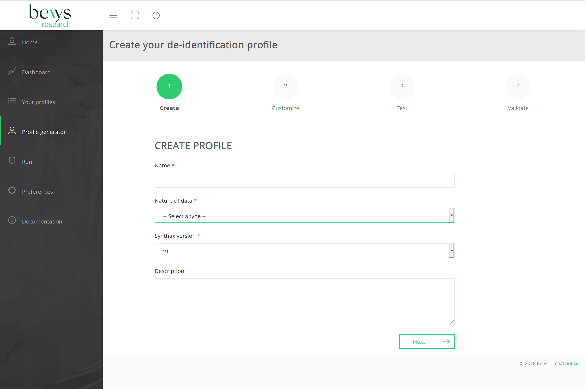

====================================
The three ways of creating a Profile
====================================

The GUI provides three differents ways to create a profile.

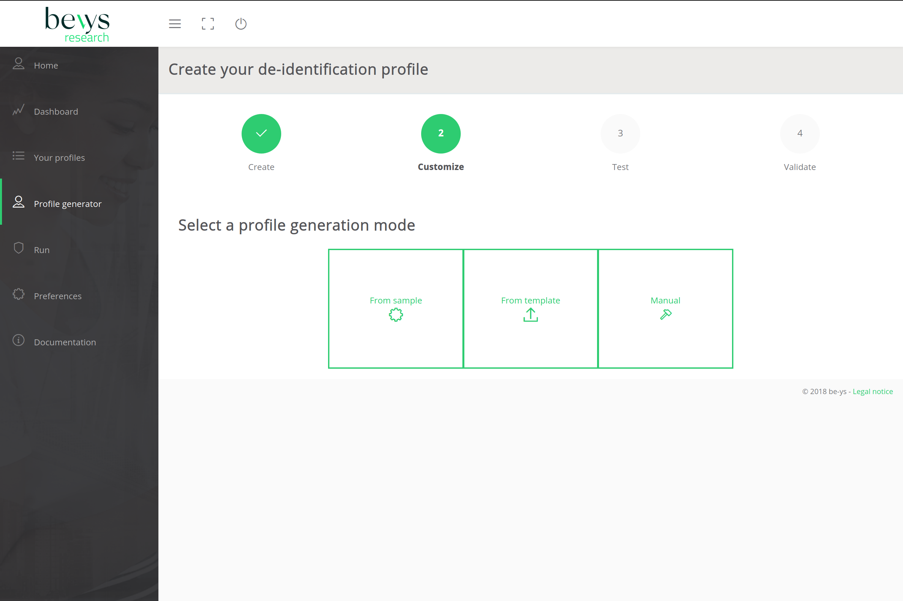

**************************************
Creating a Profile from Existing Datas
**************************************

If a sample small dataset of the data to anonymize is available.
The "From Data" feature can be used from the Profile Generator menu.
A upload of the sample dataset will be asked in order to analyse it with the AI model provided by the Anonymizer.
"Tags" or data "Field Names" will be extracted and their level of sensibility will be caracterized to help building an Anonymization profile.

The data sample can be of various formats such as XML, CSV, JSON or DICOM.
For each format additional caracteristics about the file will be asked.

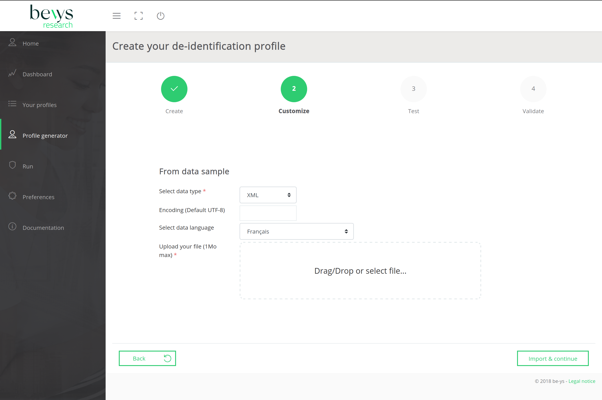

==================================================
Creating a Profile from Existing Profile Templates
==================================================

If a Profile template or an old profile is already existing.
The "From Template" feature can be used from the Profile Generator menu.
A upload of the existing YAML profile template will be asked.
This template will then be loaded in the editor.

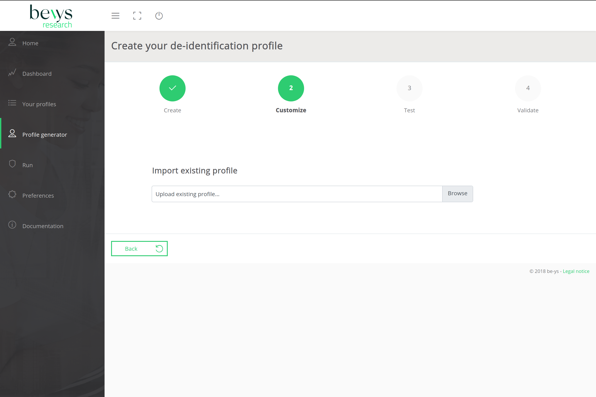

==========================================================
For advanced Profile Managers: Creating a Profile Manually
==========================================================

Advanced Profile Managers may have the need to create profiles manually from scratch.
For such purpose, the create profile "Manually" feature can be used from the Profile Generator menu.
Using this option, the Profile Manager will be directly offered a blank profile editor.

****************
The Profile List
****************

In the profile list, all the profile a user have access will be displayed and organized by their profile type.

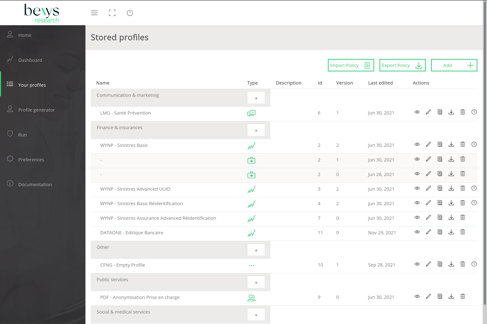

From there a user can (if he have the access rights): view, edit, duplicate, dowload, delete or display existing anterior version of a profile.

========================
Running Profiles on Data
========================

From this menu a user who have the access rights can select a profile from the available list.
It's also possible to run an anterior version of the profile by selecting it in its versions list.
Then the user can choose the format of the file of the dataset to anonymize.
Various formats are handled by the Anonymizer such as XML, CSV, JSON or DICOM.
For each format additional caracteristics about the file will be asked.
Finnally the user can upload the dataset file and run the anonymization.

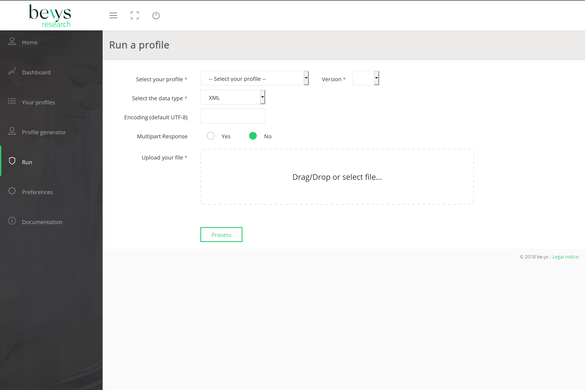

#################################
Anonymize PDFs Samples using Curl
#################################

POST entry point of the REST API is "/anonymizer/v1/process-image".

It takes as entry parameters: the profile id, profile version number, the pdf file to anonymize
and a json data containing the page number with the coordinates of the blacking rectangles to create in the file.

the ouput will be a anonymized pdf file.

The description of the REST API (Swagger) : https://fedehran1-rcc.almerys.local/swagger-ui.html go to generic-anonymizer-rest-controller section and POST /anonymizer/v1/process-image

The url of the RCC environment to use: https://fedehran1-rcc.almerys.local/

A beIAM/Keycloak application account is needed to obtain identification tokens, for exemple app_user_ano.
The "client_secret" associated to the application account will also be required.

If just the blanking of the pdf is needed an exemple of an empty profile can be used, like the one below.

::

    elements:
    - tag: "empty"
    action: "@empty()"
    comment: ""
    risk: 0
    reason: ""
    risk_check: 0

Retrieve the id of the profile and its version, here for exemple: 10 and version: 1.

Here an exemple of the json containing the coordinates of the blanking zones:

::

	[{"tag":"birthdate","value":"","startPixelX":440,"startPixelY":80,"endPixelX":567,"endPixelY":96,"pageNumber":0},{"tag":"height","value":"","startPixelX":54,"startPixelY":96,"endPixelX":108,"endPixelY":110,"pageNumber":0},{"tag":"weight","value":"","startPixelX":156,"startPixelY":96,"endPixelX":208,"endPixelY":110,"pageNumber":0},{"tag":"checkboxes","value":"","startPixelX":499,"startPixelY":194,"endPixelX":567,"endPixelY":520,"pageNumber":0}]

Curl call exemple to generate the identification token:

::

	curl --insecure -d 'client_id='app_user_ano -d 'client_secret='your_client_secret -d 'grant_type=client_credentials' https://rec.client.almerys.com/auth/realms/fedehr_ano/protocol/openid-connect/token | jq -r '.access_token'

Curl REST call to anonymize the pdf:

* please add the generated identification tokan after Bearer in -H "Authorization: Bearer " of the curl command below.
* modify the pdf file path, here for exemple /home/user/Documents/anon-pdf-files/my_pdf_to_anonymize.pdf):
* modify also the corresponding output file name, here: my_pdf_anonymized.pdf

::

	curl -k -v -X POST "https://fedehran1-rcc.almerys.local/anonymizer/v1/process-image" -H "accept: */*" -H "Content-Type: multipart/form-data" -H "Authorization: Bearer " -F "data=@/home/user/Documents/anon-pdf-files/my_pdf_to_anonymize.pdf;type=application/pdf" -F "jsonCharset=UTF-8" -F 'jsonData=[{"tag":"birthdate","value":"","startPixelX":440,"startPixelY":80,"endPixelX":567,"endPixelY":96,"pageNumber":0},{"tag":"height","value":"","startPixelX":54,"startPixelY":96,"endPixelX":108,"endPixelY":110,"pageNumber":0},{"tag":"weight","value":"","startPixelX":156,"startPixelY":96,"endPixelX":208,"endPixelY":110,"pageNumber":0},{"tag":"checkboxes","value":"","startPixelX":499,"startPixelY":194,"endPixelX":567,"endPixelY":520,"pageNumber":0}]' -F "profileId=10" -F "profileVersion=1" > my_pdf_anonymized.pdf

********
Profiles
********

=============================
Configuration Files' language
=============================

The language for the configuration files is YAML ("YAML Ain't Markup
Language). YAML is a human readable data serialization language. You
will find more information about YAML
`here <https://en.wikipedia.org/wiki/YAML>`_.

Due to the YAML Parser used, some syntax constraints have to be
respected:

* Indent using the space character (always use the same number of space characters)
* Do not indent using the tabulation character

=================================================
Configuration files for the Dicom/CSV Anonymizers
=================================================

-----------------------------------
Structure of the configuration file
-----------------------------------

The structure of the configuration file is as follows: ::

    parameters:              # Optional
      - tag: PARAM1
        value: "VALUE1"
    elements:                # Mandatory
      - tag: TAG1
        action: ACTION1
    keepActions:             # Optional (available only with DICOMS)
      - tag: GROUP1
    removeActions:           # Optional (available only with DICOMS)
      - tag: GROUP2

--------------------------------
Basic configuration file example
--------------------------------

You will find below an example of the configuration file used by the
Anonymizer: ::

    parameters:
      - tag: DATEINC
        value: "-500"
      - tag: SUBJECT
        value: Subject
      - tag: DATEPATTERN
        value: "yyyyMMdd HH:mm:ss"
      - tag: FT_CONSTANT
        value: "XXX"
    elements:
      - tag: 00100010 #PatientName
        action: "@fulltextindex(this,$FT_CONSTANT,\"DAMERAU_LEVENSHTEIN\",@append($SUBJECT,\"-\",@integer(this,4)))"
      - tag: 00100030 #PatientBirthDate
        action: "@empty()"
      - tag: 00080020 #StudyDate
        action: "@incrementdate(this,$DATEINC,$$ATEPATTERN)"
      - tag: 00080023 #ContentDate
        action: "@fulltextsearch(this)"
    keepActions:
      - tag: 0018 #Keep group 0018
    removeActions:
      - tag: curves #Remove curves

----------
Parameters
----------

You can define constants that will be used as parameters in the
functions (c.f. below) of the Anonymizer. To do so, just declare the
*parameters* section and add your constants and the corresponding values
as follows: ::

    parameters:
      - tag: PARAM1
        value: "VALUE1"
      - tag: PARAM2
        value: "VALUE2"

=================================================
Configuration file for the Dicom Pixel Anonymizer
=================================================

This configuration file allows to specify the regions of pixel to blank
on the Dicom image.

The YAML script is organized into one or more sections, with each
section being comprised of a unique signature and one or more regions.

A signature defines one image type based on constraints (more or less
complex, depending on the hardware) specified in the signature's script.

-----------------------------------
Structure of the configuration file
-----------------------------------

The structure of the configuration file is as follows: ::

    section:                              # Mandatory
      -
        signature:                        # Mandatory
          script:                         # Mandatory
            identifier: "IDENTIFIER1"     # Mandatory
            test: "TEST1"                 # Mandatory
            target: "TARGET1"             # Mandatory
        region:                           # Mandatory
          - value: "VALUE1       "        # Mandatory

--------------------------------
Basic configuration file example
--------------------------------

You will find below an example of the configuration file used by the
Anonymizer: ::

    $ cat pixel-anonymizer-script.yaml
    # manufacturer: GE
    section:
      - # name: "CT Dose Series"
        signature:
          script:
            identifier: "[0008,0104]"
            test: "containsIgnoreCase"
            target: "IEC Body Dosimetry Phantom"
        region:
          - value: "(0,0,512,200)"
      -
        signature:
          script:
            identifier: "[0008,103e]"
            test: "containsIgnoreCase"
            target: "Dose Report"
        region:
          - value: "(0,0,512,110)"
      -
        signature:
          conditions:
            andOperator:
              -
                script:
                  -
                    identifier: "[0008,0070]"
                    test: "containsIgnoreCase"
                    target: "GE MEDICAL"
                  -
                    identifier: "[0040,0310]"
                    test: "containsIgnoreCase"
                    target: "DLP"
        region:
          - value: "(0,0,512,110)"

----------------
Simple signature
----------------

::

    signature:
      script:
        identifier: "[0008,0104]"
        test: "containsIgnoreCase"
        target: "IEC Body Dosimetry Phantom"

This signature will blank the region(s) of the Dicom where the Dicom tag
"0008,0104" contains (not case sensitive) the string "IEC Body Dosimetry
Phantom".

-----------------
Complex signature
-----------------

::

    signature:
      conditions:
        andOperator:
          -
            script:
              -
                identifier: "[0008,0070]"
                test: "containsIgnoreCase"
                target: "VITAL Images"
              -
                identifier: "[0028,0010]"
                test: "containsIgnoreCase"
                target: "1041"
            orOperator:
              -
                script:
                  -
                    identifier: "[0008,103e]"
                    test: "containsIgnoreCase"
                    target: "AAA"
                  -
                    identifier: "[0008,103e]"
                    test: "containsIgnoreCase"
                    target: "Report"

This signature is more complex due to the and/or conditions.

It will blank the region(s) of the Dicom where:

* The tag "0008,0070" contains (not case sensitive) "VITAL Images" and the tag "0028,0010" contains (not case sensitive) "1041"
* and the tag "0008,103e" contains (not case sensitive) "AAA" OR "Report".

--------------------------
Available script functions
--------------------------

* contains
* containsIgnoreCase
* equals

------
Region
------

A region is a rectangular area of an image, specified by four integers,
separated by commas. +
You can have one or more regions per section. +
The four integers represent: (left position, top position, width,
height)

Syntax: ::

    region:
      - value: "(0,0,795,150)"

*NB: Setting the four integers to 0 will skip the pixel anonymization
process for the specified hardware.*::

    region:
      - value: "(0,0,0,0)"

******
Sample
******

According to the following data sample.

.. list-table:: Sample Profile
   :widths: 14 14 14 14 14 14 14
   :header-rows: 1

   * - Id
     - First name
     - Last name
     - Email
     - Gender
     - Postcode
     - Date of birth
   * - 1
     - Lina
     - Potegue
     - lina@admin.ch
     - Female
     - 63
     - 30 Jan 2008
   * - 2
     - Louis
     - Toli
     - louis@admin.ch
     - Male
     - 75
     - 21 Dec 2007
   * - 3
     - Emma
     - Molege
     - emma@admin.ch
     - Female
     - 74
     - 29 Nov 2007

An associate profile can be the next one:

::

	elements:
	  - tag: "Id"
	    action: "@keep()" 
	    comment: "" 
	    risk: 1
	    reason: "ID (Confidence rate: 76%)"
	    risk_check: 0
	  - tag: "First name "
	    action: "@remove()" 
	    comment: "" 
	    risk: 3
	    reason: "PER (Confidence rate: 100%)"
	    risk_check: 0
	  - tag: "Last name"
	    action: "@remove()" 
	    comment: "" 
	    risk: 3
	    reason: "PER (Confidence rate: 100%)"
	    risk_check: 0
	  - tag: "Email"
	    action: "@remove()" 
	    comment: "" 
	    risk: 2
	    reason: "EMAIL (Confidence rate: 100%)"
	    risk_check: 0
	  - tag: "Gender"
	    action: "@keep()" 
	    comment: "" 
	    risk: 2
	    reason: "PERSON_CHARACTERISTIC (Confidence rate: 76%)"
	    risk_check: 0
	  - tag: "Postcode"
	    action: "@remove()" 
	    comment: "" 
	    risk: 2
	    reason: "PARTIAL_LOC (Confidence rate: 78%)"
	    risk_check: 0
	  - tag: "Date of Birth"
	    action: "@remove()" 
	    comment: "" 
	    risk: 3
	    reason: "SENSITIVE_DATE (Confidence rate: 100%)"
	    risk_check: 0

##
AI
##

*******
Process
*******

An AI process running to identify sensitive data when a profile is creating from a data sample. +
The AI process consists of three steps. +
The first step is to parse header with a Machine Learning model to detect the data kind.
For those without result, the process try to catch values with patterns.
A Deep Learning model evaluates tags unclassified.
For some classified values, a checking with patterns is done. +
The deep learning model is written in Python. The package use in Python is Spacy. 
For this reason, it's necessary to use a JEP interpreter to execute the model.

****************
Detected Classes
****************

The AI model allows to detect 19 classes:

* *PER*: A person.

* *NNI*: National Number Identifier (like social security number, a plate number).

* *ID*: An Id  in the table

* *IBAN*: An IBAN number

* *CARD*: A card number

* *NORP*: Nationalities or Religious or Political, union membership, ethnic origin...

* *PERSON_CHARACTERISTIC*: A person characteristic like weight, gender, age... 

* *LOC*: A location like a address.

* *PARTIAL_LOC*: A partial location like city, a country or a district, a post code....

* *SENSITIVE_DATE*: A sensitive date like a birth date or a death date.

* *DATE*: A classic date.

* *EMAIL*: An email

* *TEL*: A telephone number.
 
* *IP*: A IP address.

* *URL*: An URL.
 
* *JOB*: A job.

* *DRUG*: A drug or a treatment.

* *DIS*: A disease or a symptom.

* *ORG*: An organization: a company, a school, a hospital...

For each detected class, a confidence rate is calculated based on model output. +
The classification and associate confidence rate are add in the profile in the reason for each tag.

######
AI GUI
######

**************
Sensitive data
**************

Tags classified as PER, NNI, IBAN, CARD, NORP, LOC, SENSITIVE_DATE, TEL, IP, JOB, DIS are considered as sensitive data.
In this case, the box background is red and the tag is badged "Sensitive data".

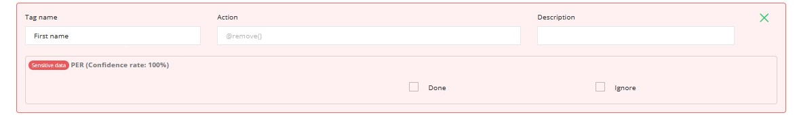

***********************
Indirect identification
***********************

Tags classified as PERSON_CHARACTERISTIC, PARTIAL_LOC, DATE, EMAIL are considered as partial identifier data.
In this case, the box background is yellow and the tag is badged "Indirect identification".

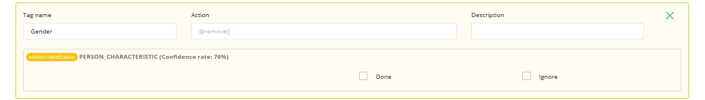

******************
Non sensitive data
******************

Tags classified as ID, JOB, ORG are considered as non sensitive data.
In this case, the box background is green and the tag is badged "Non sensitive data".

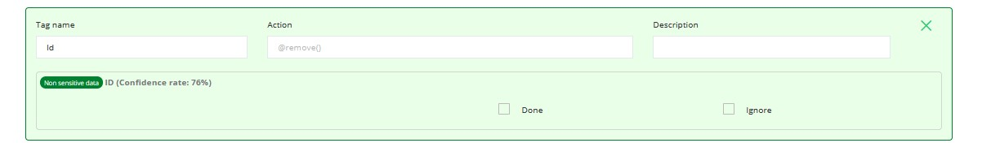

************************************
Confidence rate and Danger pictogram
************************************

For tags classified with a low confidence rate (<30 %), a pictogram appears.

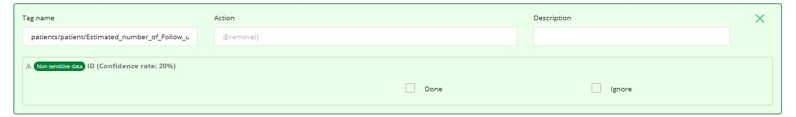

*******
UNKNOWN
*******

Unclassified tag are badged as UNKNOWN data. Its means the Ai process doesn't find a classification for the tag.
In this case, the box background is white.

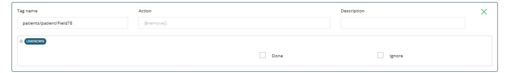

#######
Metrics
#######

*******
Entropy
*******

Entropy is a metric used in information theory. It measures the amount of information contained in data.

For more informations about entropy, click https://en.wikipedia.org/wiki/Entropy_(information_theory)[here].

The special feature of this measure is that it is bounded, so can be normalized. +
The result can be express as a number between 0 and 1 (or 0 and 100 as for Anonymizer).

======================
Entropy with threshold
======================

The entropy normalized is a good indicator but it is sensitive to some side effects.
Add a threshold to entropy enable to reduce this effect.

*****
Usage
*****

The entropy calculation is available only for CSV, JSON and XML files.

Entropy allows to evaluate the quality of the anonymization of partially identifying variables.
It is possible to evaluate the entropy of the data before and after anonymization. +
Before anonymization, sensitive and partially identifying data are use to calculate entropy. +
After anonymization, partially identifying data sensitive partially anonymized are use for the calculation. +
The difference between these two values shows the masking of the information.

=====
Input
=====

   * profileId: Id of Yaml profile.
   * profileVersion: Version of Yaml profile.
   * contentType: Type of the content (possible: values CSV, JSON or XML).
   * csvDelimiter: Only use for CSV contentType, ',' if not specified.
   * csvQuote: Only use for CSV contentType '\' if not specified.
   * csvNoHeader: Only use for CSV contentType, define if csv contains headers.
   * ignoreWhiteSpaces: Only use for CSV contentType, 'true' if not specified.
   * dataIsAnonymized: Specify if the data is anonymized true if not specified.
   * charset: Encoding charset.
   * data: The data.

==============
Interpretation
==============

The entropy result is an number between 0 and 100.

A high value of entropy should be interpreted as data enable a statistic identification.
partially identifying data (indirect identification) data is not sufficiently or efficiently treated.

With a Low value of entropy, a statistic identification is not possible on the data.