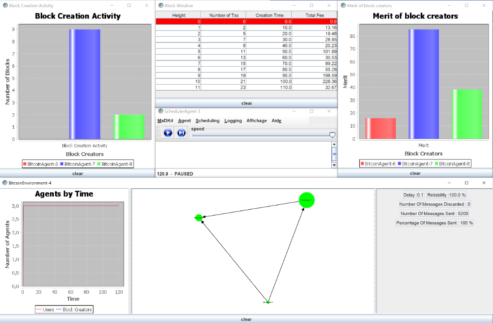
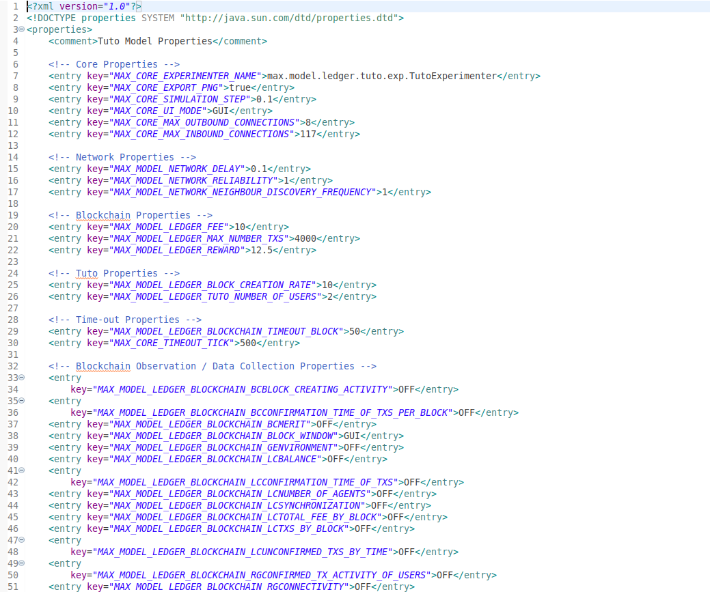

Executing an existing MAX model
=============================

Since MAX is a java application. Each model is a java application and is executed separately. To do so, the requirements are the .jar file of the model and an .xml configuration file given in parameter.

Command: java –jar model.jar –experimenter experimenter.xml

The figure below shows the execution of one of MAX models, Bitcoin, with some data inspectors enabled. At the center of the simulation, the scheduler which allows to adjust the simulation speed, even pause it if necessary. 
It is surrounded by data inspectors chosen to appear in this simulation. Namely, a general data inspector which shows the state of the network with (from left to right) a line chart of the number of agents as a function of time, an illustration of the network topology in real time as well as certain network parameters displayed at the right of the figure.
Two bar chart figures follow. One that tells us about the block creation activity and another about the merits of block creators. And finally, a table that contains information on the blocks added to the blockchain (height, number of transactions…).

This simulation has been executed with some given parameters and data inspectors chosen to be displayed. Which is possible using a configuration file that contains some parameters used in the model and their value. The advantage of using MAX under these conditions is the ability to configure the simulation with the desired values and to be able to adjust them according to the data extracted by the data inspectors activated in the .xml file show below.

1-	The .xml file contains the simulation parameters which can easily be modified.

.. csv-table:: Parameters
   :file: Parameters.csv
   :widths: 30, 70
   :header-rows: 1
   
.. list-table:: Title
   :widths: 50 100
   :header-rows: 1

   * - Data inspector
     - Description
   * - MAX_CORE_EXPERIMENTER_NAME
     - 
   * - MAX_CORE_EXPORT_PNG
     - 
   * - MAX_CORE_SIMULATION_STEP
     - 
   * - MAX_CORE_UI_MODE
     - 
   * - MAX_MODEL_NETWORK_DELAY
     - 
   * - MAX_MODEL_NETWORK_RELIABILITY
     -  
   * - MAX_MODEL_NETWORK_NEIGHBOUR_DISCOVERY_FREQUENCY
     - 
   * - MAX_CORE_MAX_OUTBOUND_CONNECTIONS
     - 
   * - MAX_CORE_MAX_INBOUND_CONNECTIONS
     - 
   * - MAX_MODEL_LEDGER_FEE
     -  
   * - MAX_MODEL_LEDGER_MAX_NUMBER_TXS
     - 
   * - MAX_MODEL_LEDGER_REWARD
     - 
   * - MAX_CORE_TIMEOUT_TICK
     -

2-	It also contains the available data inspectors (to activate/deactivate with keywords GUI/OFF)
