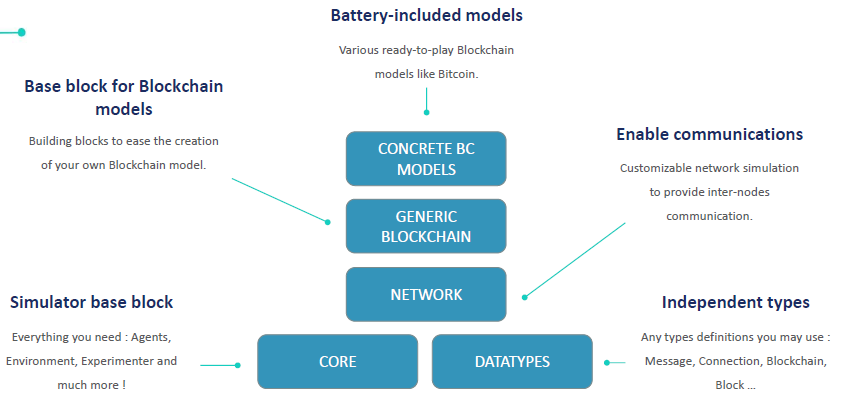

Multi-Agent eXperimenter (MAX)
=============================

Introduction
------------

**MAX** (**M**\ulti-**A**\gent e\ **X**\ perimenter) is an agent-based simulator for blockchain applications building, a tool for rapid prototyping of industrial cases and doing feasibility analysis in a realistic manner. **MAX** includes a model library to simulate the behaviour of various blockchain systems.

**MAX** allows developers of distributed ledger solutions to make rapid prototyping of industrial cases and to carry out their feasibility analysis in a realistic manner. **MAX** allows to validate design hypothesis related to properties such as scalability, security and resilience, performance, and finding the right configuration for the design, such as the right parameter values.

**MAX** is particularly well suited for modelling open, distributed and intelligent systems developing over time. By recreating the dynamics of the system at an agent level, the impact of actions executed by an algorithm under different scenarios can be tested and analysed in granular detail.

**MAX** comes with a model library, a collection of pre-written simulations that can be used and modified. These simulations, for the moment, address content areas in the network research including distributed ledger technologies research.

**MAX** provides prolific tools to setup attack scenarios to stress Byzantine-Fault-Tolerant blockchain models. **MAX** can therefore be useful for the design and evaluation of new blockchain-based protocols for privacy and data access management against malicious attacks e.g. reinforce security by simulating attacks and the algorithm's defence counter-measures.

The **MAX** generic blockchain model is a blockchain simulator to quickly and efficiently simulate an unlimited number of scenarios and measure their impact in a safe, virtual environment. **MAX** can make rapid prototyping of industrial cases and to carry out their feasibility analysis in a realistic manner. It allows modelling of blockchain system as open, distributed, multi-level and intelligent systems developing over time and thus is particularly well suited for supply chain use cases. 

The **MAX** (**M**\ulti-**A**\gent e\ **X**\ perimenter) environment makes it possible to study the behaviour of blockchain protocols under different hypotheses by means of dedicated libraries developed (in java) for this purpose (to date, Bitcoin, Tendermint, Hyperledger, Sycomore).

The figure below shows the modular architecture of MAX. The bottom two layers show the simulation engine, that provides the base for simulating distributed environments under the multi-agent paradigm. On top of this layer, a generic blockchain model is built representing the system behaviour of DLT systems, along with its associated components: a consensus oracle and a set of abstract datatypes. This layer can be re-used or improved to compute over a specific blockchain system implementation. On top of this layer, blockchain applications are built, for instance Bitcoin or Tendermint. Finally, at the topmost level, the actual end-user applications are built; for instance, a supply chain model. 

The modular architecture of MAX makes it possible to substitute one or several modules, to simulate different configurations and implementation decisions.

.. toctree::
   :maxdepth: 1

   usecase
   how_it_works
   execute_MAX_model
   develop_MAX_model
   how_to_get_access
   faq
   
   
